# Stretus — AI-Powered Trading Strategy Execution Engine

### Production-Grade Architecture & Design Document

> A unified strategy platform combining the discoverability of TradingView, the research depth of QuantConnect, the execution surface of MetaTrader, an LLM copilot, and a low-latency multi-asset OMS/RMS — designed so the *same codebase* runs on a Raspberry Pi and a 64-core bare-metal colo box.

**Audience:** senior distributed-systems engineers, quant developers, HFT engineers, AI engineers, DevOps architects, trading-infra architects.
**Status:** reference architecture, implementation-oriented.

---
V
---

## Table of Contents

1. [Executive Summary](#1-executive-summary)
2. [Functional Requirements](#2-functional-requirements)
3. [Non-Functional Requirements](#3-non-functional-requirements)
4. [Universal Strategy DSL](#4-universal-strategy-dsl)
5. [Indicator Architecture & TA-Lib Integration](#5-indicator-architecture--ta-lib-integration)
6. [Advanced Entry/Exit Filter Framework](#6-advanced-entryexit-filter-framework)
7. [AI / NLP Architecture](#7-ai--nlp-architecture)
8. [Multi-Asset Market Support](#8-multi-asset-market-support)
9. [Market Data Architecture](#9-market-data-architecture)
10. [Dynamic Universe & Runtime Asset Discovery](#10-dynamic-universe--runtime-asset-discovery)
11. [Strategy Execution Engine](#11-strategy-execution-engine)
12. [Order Management System (OMS)](#12-order-management-system-oms)
13. [Risk Management System (RMS)](#13-risk-management-system-rms)
14. [Backtesting & Simulation](#14-backtesting--simulation)
15. [Paper Trading Subsystem (First-Class)](#15-paper-trading-subsystem-first-class)
16. [Optimization & AI-Assisted Research](#16-optimization--ai-assisted-research)
17. [SIP & Recurring Investment Engine](#17-sip--recurring-investment-engine)
18. [Strategy Marketplace & Compliance-Aware Publishing](#18-strategy-marketplace--compliance-aware-publishing)
19. [Plugin & Extensibility Architecture](#19-plugin--extensibility-architecture)
20. [Scalability Architecture](#20-scalability-architecture)
21. [Technology Stack Recommendations](#21-technology-stack-recommendations)
22. [Security Architecture](#22-security-architecture)
23. [Observability & Monitoring](#23-observability--monitoring)
24. [Deployment Architecture](#24-deployment-architecture)
25. [Suggested Folder Structure](#25-suggested-folder-structure)
26. [Implementation Schemas](#26-implementation-schemas)
27. [Flagship Worked Example: ETH Volatility-Compression Breakout](#27-flagship-worked-example-eth-volatility-compression-breakout)
28. [Example End-to-End Execution Flow](#28-example-end-to-end-execution-flow)
29. [Complex Strategy Coverage Examples](#29-complex-strategy-coverage-examples)
30. [Testing & Validation Strategy](#30-testing--validation-strategy)
31. [Performance & Benchmark Plan](#31-performance--benchmark-plan)
32. [Tradeoffs & Design Decisions](#32-tradeoffs--design-decisions)
33. [Phased Delivery Roadmap](#33-phased-delivery-roadmap)
34. [Future Roadmap](#34-future-roadmap)

- [Appendix A — Component Diagram (system-wide)](#appendix-a--component-diagram-system-wide)
- [Appendix B — Implementation sequencing (pragmatic build order)](#appendix-b--implementation-sequencing-pragmatic-build-order)

> **Scope note:** This is a single, unified architecture. Every capability described here — natural-language authoring, the dynamic universe engine, the TA-Lib-validated indicator engine, advanced entry/exit filters, multi-asset OMS/RMS, first-class paper trading, SIP/recurring investing, and the compliance-aware marketplace — is a **day-one, first-class part of the design**, not a later add-on. Sections are ordered to follow the data-and-control flow of the platform. The roadmap (§33) phases only the *implementation order*; it never reduces architectural scope.

---

## 1. Executive Summary

### 1.1 Vision

Stretus lets a trader express intent in plain language — *"Buy BTC when 9 EMA crosses above 20 EMA on the 5-minute chart with RSI below 30"* — and turns that into a **typed, validated, deterministically-executable strategy graph** that can be backtested on tick data, paper-traded, optimized, and deployed live across crypto, equities, futures, and options venues, all without the trader ever touching imperative code unless they want to.

The central architectural conviction is this:

> **The LLM is a compiler front-end, not the runtime.** Natural language is parsed into a strict intermediate representation (IR); from that point forward, everything is deterministic, type-checked, and reproducible. AI *proposes*; the deterministic core *disposes*. No LLM token ever sits on the order-execution hot path.

This separation is what makes the system simultaneously approachable for beginners and trustworthy enough for institutional capital.

### 1.2 Key Objectives

| Objective | How it's achieved |
|---|---|
| Natural-language authoring with zero-code option | LLM front-end → Intent Graph → DSL compiler |
| Reproducibility & auditability | Event sourcing + content-addressed strategy artifacts (hash-pinned) |
| Safety of AI output | Symbolic verification layer; AI output is never directly executable |
| Single codebase, retail→institutional | Same Rust runtime, config-driven resource envelopes; tiered feature flags |
| Multi-asset, multi-broker | Normalized instrument/venue abstractions + adapter SPI |
| Low latency where it matters | Hot path in Rust, lock-free, zero-copy; cold path (AI/research) async |

### 1.3 Technical Philosophy

1. **Compile, don't interpret intent.** The risky, non-deterministic step (NL → structured) happens once, at authoring time, gated by human confirmation. Execution is a pure function of `(strategy_artifact, market_event_stream, state)`.
2. **Determinism is a feature, not a constraint.** Given the same input event log and the same strategy hash, the engine must produce byte-identical decisions. This underpins backtesting fidelity, incident replay, and compliance.
3. **Mechanical sympathy.** The execution core is designed around CPU cache lines, NUMA locality, and branch predictability — not around microservice fashion.
4. **Tiered complexity.** A beginner sees a chat box and guardrails; a quant sees the DSL; an algo dev sees the WASM plugin SDK. The *same* IR sits underneath all three.
5. **Fail closed.** Any ambiguity in risk, connectivity, or strategy validity halts to a safe state (flat or hold), never to an assumed-permissive state.

### 1.4 Scalability, Latency & Reliability Goals (summary)

- **Latency goal:** sub-microsecond strategy-node evaluation in-process; broker-bound order latency dominated by network/exchange, with internal OMS overhead < 50 µs (p99).
- **Scalability goal:** linear scale from 1 strategy on a Pi to 100k+ concurrent strategies across a shard cluster, with no code fork.
- **Reliability goal:** no single point of failure in live trading; RPO ≈ 0 (event-sourced), RTO < 5 s for strategy failover via warm standbys.
- **Extensibility goal:** new indicator, broker, asset class, or risk rule added without recompiling the core — via WASM plugins or adapter crates.

### 1.5 AI Integration Philosophy

AI appears in four bounded roles, each with a hard boundary against the deterministic core:

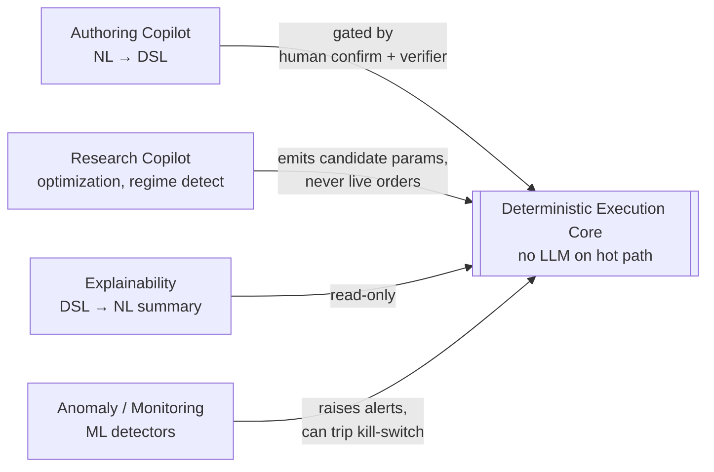

AI never directly: places an order, mutates risk limits, or modifies a running strategy. It can only produce *artifacts* (DSL, parameter sets, alerts) that pass through the same validation gates a human author would.

### 1.6 Day-One Capability Pillars

The platform is multi-asset and institutional-scale from day one. The following are **first-class architectural pillars, not later add-ons** — each is woven into the same DSL → IR → DAG → OMS/RMS spine described throughout this document:

| Pillar | What it means | Where |
|---|---|---|
| **Dynamic universes** | Strategies bind to a *rule for choosing instruments* (screener + ranking + eligibility), resolved at runtime — the asset need not be named in the prompt | §10 |
| **TA-Lib-validated indicators** | Native incremental kernels on the hot path, TA-Lib as the correctness oracle, 200+ indicators, multi-timeframe, cached/reused | §5 |
| **Advanced entry/exit filters** | One predicate-node implementation powering entries, exits, screeners, and optimization (regime, RS, liquidity, spread, news, correlation…) | §6 |
| **First-class paper trading** | The *identical* DSL/compiler/IR/DAG/OMS/RMS/portfolio stack as live — only the execution adapter is swapped | §15 |
| **SIP / recurring investing** | Scheduled, cash-flow-driven strategies (fixed, dynamic, value-averaging, goal-based, drift rebalance) with consent workflow | §17 |
| **Compliance-aware marketplace** | Publisher eligibility, jurisdiction rules, strategy classification, approval workflow, immutable audit | §18 |
| **The deployment ladder** | Backtest → Forward Test → Paper → Limited Capital → Full Production, gated by readiness/confidence scores | §15.5 |

These pillars share the platform's core invariants — determinism, the AI-as-compiler-front-end boundary, fail-closed safety, and content-addressed reproducibility — so they compose rather than bolt on. The phased roadmap (§33) sequences *when each is implemented*, never *whether the architecture supports it*.

---

## 2. Functional Requirements

| # | Capability | Notes |
|---|---|---|
| F1 | **NL strategy creation** | Chat + slash-command DSL hybrid; clarification dialogue for ambiguity |
| F2 | **Multi-asset** | Equities, FX, crypto (CEX+DEX), futures, options, commodities, bonds, ETFs, synthetics |
| F3 | **Backtesting** | Event-driven, tick & bar, with slippage/latency/liquidity models |
| F4 | **Paper trading** | Same engine as live, fed by live data, orders routed to a simulated matching layer |
| F5 | **Live trading** | Multi-broker, smart order routing, failover |
| F6 | **Multi-broker connectivity** | Binance, Zerodha/Kite, IBKR, CME (via FIX), Coinbase, DEX routers |
| F7 | **Strategy versioning** | Content-addressed (hash) artifacts; immutable history; diff & rollback |
| F8 | **Real-time monitoring** | Per-strategy PnL, exposure, node-level state, latency heatmaps |
| F9 | **Risk management** | Pre/post-trade checks, hierarchical limits, kill switches |
| F10 | **Portfolio management** | Cross-strategy netting, portfolio VaR, correlation-aware sizing |
| F11 | **Alerts** | Conditions, webhooks, push, email, on-chart annotations |
| F12 | **AI-assisted optimization** | Bayesian/GA/RL parameter search, walk-forward, AutoML |
| F13 | **Explainability** | Every signal traceable to inputs; NL rationale on demand |
| F14 | **Multi-user / RBAC** | Roles: viewer, author, trader, risk-admin, org-admin |
| F15 | **Multi-tenant** | Logical isolation, per-tenant resource quotas, optional dedicated shards |
| F16 | **Mobile/Web APIs** | gRPC + gRPC-Web + REST gateway + WebSocket streams |
| F17 | **Plugin ecosystem** | WASM sandbox for indicators/risk/execution; native crate SPI for trusted adapters |
| F18 | **Marketplace** | Sign/publish/license strategies & plugins; revenue share; reputation |
| F19 | **Dynamic universe selection** | Runtime asset discovery via screeners + ranking + eligibility; static, watchlist, sector, index, exchange, or fully dynamic universes (§10) |
| F20 | **Indicator engine (TA-Lib-validated)** | 200+ indicators, native incremental kernels, TA-Lib parity oracle, multi-timeframe, caching, custom (WASM) indicators (§5) |
| F21 | **Advanced entry/exit filters** | Volatility/regime/RS/liquidity/spread/volume/trend/session/news/earnings/correlation/sector filters, shared across entry, exit, screening, optimization (§6) |
| F22 | **SIP / recurring investing** | Fixed/dynamic/value-averaging/goal-based schedules, drift rebalancing, e-mandate consent workflow (§17) |
| F23 | **Compliance-aware publishing** | Publisher eligibility, jurisdiction rules, strategy classification, approval workflow, immutable audit (§18) |
| F24 | **Deployment ladder** | Backtest → forward test → paper → limited capital → full, with readiness/confidence gating (§15.5) |

### 2.1 Tiered UX mapping

| Persona | Primary surface | Power tools available |
|---|---|---|
| Beginner | Chat copilot, templates, guardrail-on defaults | — |
| Intermediate | Chat + visual node editor | DSL view (read) |
| Discretionary pro | Charting + manual OMS + alert rules | DSL edit |
| Quant | DSL editor, notebook research, backtester | Full IR, custom formulas |
| Institutional | Multi-account OMS, RMS console, audit | FIX, dedicated shards, SSO |
| Algo developer | WASM/native SDK | Plugin publishing, raw event hooks |

---

## 3. Non-Functional Requirements

### 3.1 Performance targets

These are *design* targets for the in-process Rust runtime on a modern x86 core (pinned, NUMA-local). They are deliberately split by tier because the same binary serves a Pi and a colo box.

| Metric | Retail tier | Pro tier | HFT/colo tier |
|---|---|---|---|
| Tick ingest → normalized event | < 50 µs | < 10 µs | < 2 µs |
| Single strategy-node eval | < 5 µs | < 1 µs | < 200 ns (vectorized) |
| Full strategy graph eval (typical) | < 100 µs | < 20 µs | < 5 µs |
| Internal order intent → adapter handoff | < 500 µs | < 100 µs | < 50 µs |
| Order → exchange ack | network-bound | network-bound | colo, kernel-bypass |
| Max concurrent strategies / node | ~50 | ~5,000 | tuned per case |
| Max instruments / node | ~1,000 | ~50,000 | ~500,000 (sharded) |
| Event throughput / node | ~50k/s | ~2M/s | ~10M+/s (busy-poll, SIMD) |

> **Honest caveat:** true HFT (sub-microsecond wire-to-wire, FPGA, kernel-bypass) is a *specialization* of this architecture, not its default. The general-purpose path optimizes for *flexibility at low-but-not-zero latency*. Section 21 details that tradeoff explicitly — you cannot have maximum expressive flexibility *and* FPGA-class determinism in the same node without giving something up.

### 3.2 Reliability / HA / DR

- **Fault tolerance:** supervised actor tree; a crashing strategy actor is isolated and restarted from its last checkpoint; it cannot take down peers or the core.
- **HA:** each shard runs leader + warm standby; standby consumes the same event log and maintains shadow state.
- **DR:** event log replicated across AZs (and optionally regions); RPO≈0 because state is derivable from the immutable log.
- **RTO:** standby promotion < 5 s; in-flight orders reconciled against broker state on promotion (idempotent client order IDs).

### 3.3 Resource & efficiency

- **Memory:** ring buffers + arena allocation per strategy; bounded by configured quota; no unbounded queues (backpressure instead).
- **CPU:** core pinning, optional busy-poll on hot shards, SIMD for indicator batches.
- **GPU:** optional, only for ML inference / large backtests; never required.
- **Edge:** the runtime compiles to a single static binary (musl); a stripped profile runs in < 128 MB RAM with local quantized model offloaded or disabled.

### 3.4 Security, compliance, observability, auditability

- Secrets in a vault, never in artifacts; per-tenant encryption keys.
- Immutable, hash-chained audit log of every order, risk decision, and strategy mutation.
- Full distributed tracing (OpenTelemetry), structured logs, RED+USE metrics.
- Compliance hooks: trade reporting export, MiFID/SEBI-style audit trails, configurable jurisdiction rules (the engine provides mechanisms; legal mapping is deployment-specific).

---

## 4. Universal Strategy DSL

The DSL is the **load-bearing abstraction** of the whole system. Every persona, every asset class, and every AI output reduces to the *same* typed IR. Get this right and the rest is engineering; get it wrong and you build five incompatible systems.

### 4.1 The compilation pipeline


Three artifacts matter and are each content-addressed (hashed):

- **Surface DSL** — human-readable/editable source (text).
- **Strategy IR** — canonical, normalized, the unit of versioning and verification.
- **Execution DAG** — IR lowered to a scheduled graph of nodes with explicit state/statelessness, data dependencies, and timeframe alignment.

### 4.2 Surface DSL example

The DSL is declarative and reads close to intent. It is *not* Turing-complete by default (custom scripts are an explicit, sandboxed escape hatch — see §19), which is what makes it statically analyzable.

```yaml
strategy "ema_cross_btc":
  universe: [BINANCE:BTCUSDT]
  timeframe: 5m

  inputs:
    fast: ema(close, 9)
    slow: ema(close, 20)
    rsi14: rsi(close, 14)

  signals:
    long_entry:  crosses_above(fast, slow) and rsi14 < 30
    long_exit:   crosses_below(fast, slow)

  rules:
    - when long_entry  -> enter long
        size: risk_pct(capital, 1.0)            # risk 1% of capital
        stop: atr_stop(atr(14), mult=2.0)        # dynamic SL
        take_profit: trailing(atr(14), mult=3.0) # trailing TP

    - when long_exit   -> close long

  risk:
    max_position_pct: 20
    max_daily_loss_pct: 5
```

A more advanced example showing multi-timeframe, sessions, and options:

```yaml
strategy "nifty_iv_crush":
  universe: { options_chain: NSE:NIFTY, type: weekly }
  session: NSE_REGULAR

  context:
    earnings_just_passed: event(corporate.earnings, within=1d, dir=past)
    iv_rank: implied_vol_rank(lookback=30d)

  signals:
    crush_setup: earnings_just_passed and iv_rank > 80

  rules:
    - when crush_setup -> open structure short_straddle(
          atm_offset: 0, dte: 7, qty: lots(2),
          delta_neutral: true, hedge: futures)
      guard:
        max_delta: 50
        max_vega: -2000
```

### 4.3 AST → IR

The surface AST is parsed (a hand-written recursive-descent + Pratt parser for expressions, in Rust, producing precise spans for error messages). It is then lowered to an SSA-style IR where every *signal* is a node:

```rust
// Strategy IR — simplified
enum Node {
    Source { instrument: InstId, field: Field, tf: Timeframe },          // stateless source
    Indicator { kind: IndKind, params: Params, inputs: Vec<NodeId>,      // stateful
                state: StateSpec },
    Expr { op: Op, inputs: Vec<NodeId> },                                // stateless pure
    CrossUp { a: NodeId, b: NodeId },                                    // stateful (needs prev)
    Window { kind: WinKind, len: usize, input: NodeId },                 // stateful ring
    Signal { name: Symbol, predicate: NodeId },                          // boolean stream
    Rule { trigger: NodeId, action: Action, guards: Vec<Guard> },
}

struct StateSpec {                 // declared, so the scheduler knows what to checkpoint
    bytes: usize,                  // bounded; enables arena pre-allocation
    warmup: usize,                 // bars needed before node emits valid output
    deterministic: bool,
}
```

**Why SSA?** It makes Common Subexpression Elimination trivial — if two rules both reference `ema(close, 20)`, the IR has exactly one node, computed once per tick, fanned out. This is the single biggest indicator-side performance win.

### 4.4 Optimization pipeline (IR → DAG)

| Pass | Purpose |
|---|---|
| **CSE** | Deduplicate identical indicator/expr nodes (one EMA20, not five) |
| **Node fusion** | Fuse chains of elementwise ops into one vectorized kernel (e.g. `(a-b)*c`) |
| **Constant folding** | Resolve compile-time constants and unit conversions |
| **Timeframe alignment** | Insert resamplers; pin every node to a clock domain; reject illegal mixing |
| **Warmup propagation** | Compute graph-wide warmup = max over paths; gate emission |
| **Dead-code elimination** | Drop nodes no rule depends on |
| **Schedule** | Topological order; partition into stateless (parallelizable) and stateful (ordered) sets |
| **Vectorization tagging** | Mark node batches eligible for SIMD / batch-over-instruments |

### 4.5 Signal dependency graph & state classification

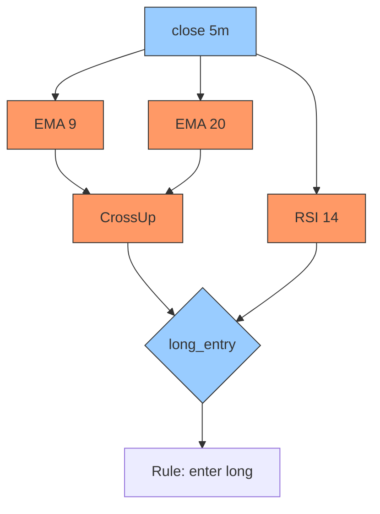

- **Stateless nodes** (pure expressions, comparisons): freely parallelizable, no checkpoint needed, recomputable.
- **Stateful nodes** (EMAs, windows, cross-detectors, position/PnL accumulators): own a bounded ring/scalar state, must be processed in event order, are checkpointed.

This classification *is* the contract between the DSL and the runtime scheduler (§11).

### 4.6 Event-sourcing model

The strategy's entire lifecycle is a fold over an append-only event log:

```
state_n = fold(reducer, state_0, [e_1, e_2, ..., e_n])
```

Events: `MarketTick`, `BarClosed`, `OrderAck`, `Fill`, `RiskDecision`, `ParamUpdate`, `Halt`. Because state is a deterministic fold, **backtest, replay, live, and recovery share one code path** — you only swap the event source. This is the reproducibility guarantee in §1.3 made concrete.

### 4.7 What the DSL must express (coverage map)

| Domain | DSL mechanism |
|---|---|
| Indicators | Built-in `indicator` nodes + WASM custom indicators |
| Price action / candlestick patterns | Pattern-matcher nodes (`engulfing`, `pin_bar`, ...) over OHLC stream |
| Smart-money / ICT (FVG, order blocks, liquidity sweeps) | Structural detectors as stateful window nodes |
| Options Greeks | `delta/gamma/vega/theta` nodes sourcing a pricing model (BS/Heston pluggable) |
| Stat-arb / pairs | Multi-instrument sources + `zscore(spread)`, cointegration guard |
| Arbitrage | Cross-venue sources + latency-aware execution rules |
| HFT logic | Tick-level sources, microstructure features, busy-poll schedule tag |
| ML signals | `ml_signal(model_ref)` node → loads a pinned model artifact |
| RL policies | `rl_policy(policy_ref)` for sizing/execution; outputs bounded by guards |
| Custom formulas / scripts | Sandboxed WASM expression nodes |
| Event / time / session logic | `event()`, `session()`, `time_window()` nodes |
| Multi-timeframe / cross-asset | Multiple clock domains + resamplers in one graph |
| Portfolio-level logic | A super-graph: per-strategy graphs feed a portfolio reducer node |

---

## 5. Indicator Architecture & TA-Lib Integration

### 5.1 Two-layer indicator engine

The platform ships a **native, incremental, streaming indicator engine** as the runtime path, with **TA-Lib as the correctness oracle** rather than the hot-path dependency. Reason: TA-Lib's batch C API recomputes over a window; a live tick engine needs *O(1)-per-tick incremental* updates and must run in a deterministic, allocation-free loop. So the design is:

```mermaid
flowchart LR
    DEF[Indicator Definition<br/>declarative spec] --> NATIVE[Native incremental kernel<br/>streaming, O(1)/tick, SIMD-batched]
    DEF --> TALIB[TA-Lib batch reference]
    NATIVE --> RT[Live + backtest runtime]
    TALIB --> PARITY[Parity test harness §30]
    NATIVE --> PARITY
    PARITY -->|must match within tol| CI[CI gate]
```

- **Native kernels** power live and backtest (incremental EMA, Welford-style rolling variance for Bollinger, Wilder smoothing for RSI/ATR/ADX, ring-buffer Donchian, etc.).
- **TA-Lib** is the *reference*: every native kernel has a parity test asserting it matches TA-Lib's batch output within a tight tolerance over many random series (§30.3). This gives you TA-Lib *correctness* with streaming *performance*.
- Where a native kernel doesn't yet exist, the engine can fall back to a windowed TA-Lib call (correct but slower) — flagged in telemetry so you know which indicators are on the slow path.

### 5.2 Coverage (200+)

Built-in native kernels target the full common set; the rest are generated from TA-Lib definitions:

`RSI, MACD, ATR, Bollinger Bands, EMA, SMA, WMA, DEMA, TEMA, VWAP, SuperTrend, ADX/DI, Aroon, Williams %R, Stochastic (fast/slow/full), Parabolic SAR, Donchian, Keltner, Ichimoku, CCI, ROC, OBV, MFI, Chaikin Osc, ADL, TRIX, Ultimate Osc, Stoch RSI, Vortex, KST, DPO, Coppock, market-breadth (A/D line, McClellan), 60+ candlestick patterns (engulfing, doji, hammer, harami, morning/evening star…)` plus custom (WASM) indicators.

### 5.3 Warmup, multi-timeframe, caching

| Concern | Mechanism |
|---|---|
| **Warmup** | Each kernel declares `warmup(params)` (e.g. EMA(200) → ~200 bars, Wilder ATR(14) → ≥14). Graph-wide warmup = max over dependency paths (§4.4); the strategy emits *no signals* and places *no orders* until warm. Backtests pre-roll history; live pre-loads from the historical store. |
| **Multi-timeframe** | An indicator is pinned to a clock domain (`ema(close,200)@1d` inside a `15m` strategy). The aggregator produces aligned higher-TF bars; resamplers bridge domains; **no partial higher-TF bar leaks** (a daily EMA only updates on daily close, not intrabar — enforced, and a common source of look-ahead bugs). |
| **Caching / reuse** | CSE (§4.4): `ema(close,200)` referenced by 5 rules and by the screener is computed **once per (instrument, TF, bar)** and fanned out. Indicator values are content-keyed `(instrument, indicator, params, tf, bar_close_ts)` → shared across strategies on the same instrument via the L1 cache (§21.3). |
| **Vectorized eval** | For dynamic universes (hundreds of instruments, same indicator set), kernels run as SIMD batches across instruments — one EMA step over a packed vector of 256 symbols, not 256 scalar calls. |

### 5.4 Custom indicators

Authored as WASM plugins (§19) implementing the indicator ABI: declare inputs, `warmup`, and an incremental `update(state, bar) → value`. Sandboxed, fuel-limited, deterministic, content-hashed for reproducibility. A custom indicator is indistinguishable from a built-in to the DSL.

---

## 6. Advanced Entry/Exit Filter Framework

### 6.1 Filters are predicates, and predicates are one thing

A filter is just a **boolean DAG node**. The architectural win is that the *same* predicate node type powers (a) entry conditions, (b) exit conditions, (c) universe screeners (§10), and (d) optimization variables. There is exactly one filter implementation, evaluated identically in backtest and live.

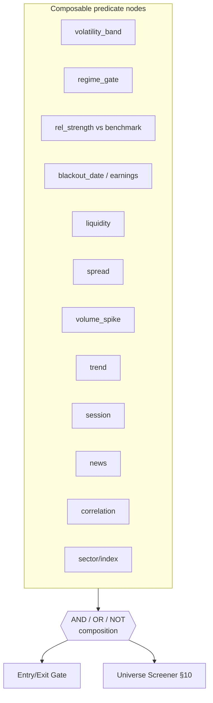

### 6.2 Filter catalogue

| Filter | Definition (example) | Data dependency |
|---|---|---|
| **Volatility band** | `atr_pct() between [lo,hi]` or `bbwidth() < pctile(20)` | OHLC |
| **Market-regime gate** | `regime() == TRENDING` (HMM/ADX/changepoint detector) | OHLC / index |
| **Relative strength** | `rs(asset, NIFTY, 63) > 0` (price ratio slope vs benchmark) | asset + benchmark series |
| **Event/blackout** | `not within(earnings_date, ±1d)`; `not in(holiday_calendar)` | event calendar |
| **Liquidity** | `adv(20) > min_adv and depth_at(1bp) > X` | trades + book |
| **Spread** | `spread_bps() < threshold` | top of book |
| **Volume spike** | `volume > k * sma(volume,20)` | volume |
| **Trend** | `close > ema(200)` / SuperTrend up | OHLC |
| **Session** | `in_session(NSE_REGULAR)`; `time between 09:15–15:00` | clock/calendar |
| **News** | `news_impact_score() < HIGH` (NLP feed, §7 ontology) | news feed |
| **Earnings/event** | `days_to_earnings() > 1` | corporate calendar |
| **Correlation** | `rolling_corr(asset, existing_position) < 0.7` | multi-asset |
| **Sector/index** | `sector(asset) in [allowed]` | reference data |

### 6.3 Representation across the lifecycle

- **DSL:** filters appear as named boolean expressions under `filters:`, reused by entries, exits, and the universe `screen:` block.
- **IR/DAG:** each filter lowers to predicate nodes (some stateful, e.g. rolling correlation; some stateless). CSE deduplicates shared filters (a `trend` filter used by entry *and* universe computes once).
- **Backtest:** evaluated against point-in-time data only; the news/earnings/blackout filters read a *historical* event calendar (no future leakage) — covered by the look-ahead test (§30).
- **Live:** identical nodes; the news/event filters subscribe to live calendars/feeds, with a *fail-closed* default — if the news feed is stale, the news filter evaluates to "blocked" rather than "clear" (you don't trade through an outage of your safety filter).
- **Optimization:** filter thresholds (`k`, percentile, lookbacks) are first-class search parameters (§16); turning a filter on/off is a categorical hyperparameter, enabling ablation studies ("does the regime gate actually add Sharpe?").

---

## 7. AI / NLP Architecture

### 7.1 The cardinal rule

> The LLM produces **Surface DSL or Intent Graph slots only**. It is structurally incapable of producing an executable order. Its output is *re-parsed and verified by the exact same deterministic compiler a human-written strategy goes through.* If it doesn't compile and pass the verifier, it doesn't run.

This makes "hallucination" a *compile error*, not a trading loss.

### 7.2 Pipeline

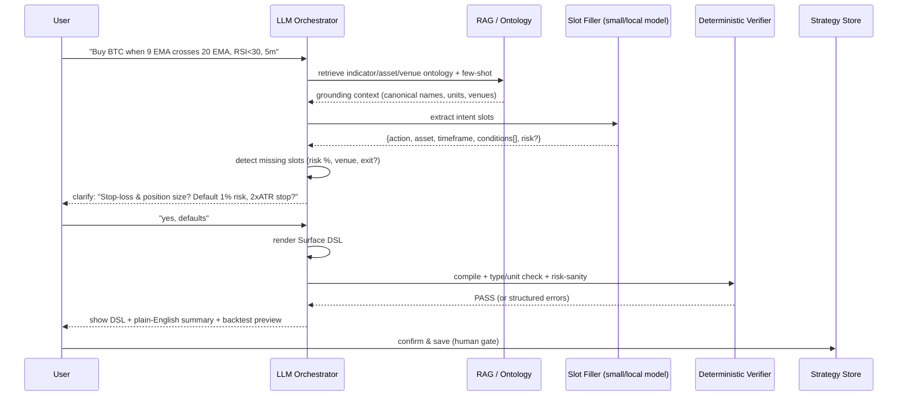

### 7.3 Components

| Component | Role | Implementation note |
|---|---|---|
| **LLM Orchestrator** | Plans the dialogue, decides when to clarify vs. infer | Any model **via OpenRouter** (model-agnostic); runs in the async AI service (§7.7); stateless per request, state in session store |
| **Intent extraction** | NL → structured intent | Constrained decoding to a JSON schema (grammar-constrained) — eliminates malformed output |
| **Entity/parameter inference** | Map "BTC" → `BINANCE:BTCUSDT`, "5 minute" → `5m` | RAG over instrument ontology + venue config |
| **Clarification engine** | Computes the *minimal* set of missing-but-required slots | Slot completeness checked against DSL schema; asks only what defaults can't safely cover |
| **Constraint validator** | "RSI<30 AND RSI>70" → contradiction; "size 200%" → impossible | Pure symbolic, deterministic |
| **Deterministic verification layer** | The compiler + a strategy linter (e.g. no entry without exit, no unbounded risk) | Hard gate before any save/deploy |
| **Market ontology / knowledge graph** | Canonical names, synonyms, asset taxonomy, indicator definitions, venue capabilities | Versioned; the *grounding truth* for RAG |

### 7.4 Hallucination prevention (defense in depth)

1. **Grammar-constrained decoding** — the model can only emit tokens valid in the intent JSON schema. Syntactically impossible to produce garbage structure.
2. **Ontology grounding (RAG)** — "stochastic momentum oscillator" must resolve to a *registered* indicator or the slot fails; the model cannot invent indicators.
3. **Symbolic validation** — unit checks (you cannot compare a price to an RSI), contradiction detection, range checks.
4. **Compiler gate** — must lower to valid IR.
5. **Strategy linter** — semantic rules: every entry has an exit path; risk is bounded; no order without a stop or explicit acknowledgment of unbounded risk.
6. **Human confirmation** — the rendered DSL + plain-English summary + a fast backtest preview are shown before save. Nothing deploys silently.
7. **Backtest sanity** — optional auto-backtest; absurd results (e.g. 9000% in a day) flagged as likely look-ahead bug, not a green light.

### 7.5 Hybrid symbolic + AI

The system is deliberately **neuro-symbolic**: the neural part handles the fuzzy NL→structure mapping (which is genuinely hard and benefits from learning); the symbolic part handles everything where correctness is non-negotiable (typing, units, risk, execution). The boundary is the Intent Graph schema.

### 7.6 Beginner vs expert handling

- **Beginner:** copilot infers sane defaults, explains every choice, refuses to deploy without a stop-loss, offers templates.
- **Intermediate:** copilot proposes DSL; user tweaks via chat or node editor.
- **Expert:** bypasses chat, writes DSL or uses the notebook SDK directly; AI becomes an optional reviewer ("explain risks in this strategy", "suggest a regime filter").
- **Ambiguity:** resolved by the clarification engine, which asks the *fewest* questions — only slots that are (a) required and (b) not safely defaultable.

### 7.7 Model serving via OpenRouter & the AI microservice

All model calls go through **OpenRouter** behind a thin Go client, so Stretus is **model-agnostic** — switch between frontier and open-source models per task with config, no code change, and route to cheaper/open models as they improve. For air-gapped or dedicated deployments, the same OpenAI-compatible client points at a self-hosted endpoint (e.g. vLLM/Ollama) instead of OpenRouter; the calling code is identical.

The **AI microservice (service #4, §21.2)** owns all of this and runs **fully async** — it is never on the order hot path. Its responsibilities:

| Responsibility | What it does | Backed by |
|---|---|---|
| **Async chat** | Conversational authoring/clarification; streamed responses to the UI | OpenRouter (interactive model) |
| **Strategy generation** | NL → Surface DSL (grammar-constrained), then hands to the deterministic verifier | OpenRouter + RAG/ontology |
| **Strategy evaluation** | Reviews/explains a strategy, flags risks, proposes filters/regime gates | OpenRouter (reasoning model) |
| **Backtest orchestration** | Turns an evaluation request into backtest jobs, dispatches to the Backtest service (#5), summarizes results in NL | gRPC to Backtest, Kafka job hand-off |

Model selection by task (all via OpenRouter routing):

| Task | Model class | Why |
|---|---|---|
| Slot filling / entity extraction | small/fast (e.g. 7–8B open) | cheap, low-latency, high volume |
| Complex decomposition / strategy reasoning | frontier or strong open | harder reasoning, called less often |
| Explainability / evaluation summaries | small–medium | read-only, low stakes |

- **Async everywhere:** chat and generation stream tokens back through the Gateway to React over WS/SSE; backtest/eval requests are queued on Kafka and answered when ready — the UI shows progress, never blocks.
- **Confidence gating:** low-confidence parses escalate to a stronger model (a different OpenRouter route) automatically.
- **Distillation path:** collect `(NL, accepted-DSL)` pairs from confirmed strategies to fine-tune/distill a cheap open model, then point OpenRouter (or the self-hosted endpoint) at it — turning expensive calls into cheap ones over time.

---

## 8. Multi-Asset Market Support

### 8.1 The instrument abstraction

The hardest part of multi-asset is *not* the strategies — it's the unifying model. Stretus models everything as an **Instrument** with capability traits, so a strategy node never special-cases an asset class unless it wants to.

```go
type InstrumentID struct {        // globally unique, content-stable
    Venue  VenueID                // BINANCE, NSE, CME, IBKR, UNISWAP_V3
    Symbol string                 // BTCUSDT, NIFTY24DEC18000CE, ESZ5
    Kind   AssetKind              // Spot | Perp | Future | Option | Equity | Bond | DexPair | Synthetic
}

type Instrument interface {
    TickSize() Price
    LotSize() Qty
    QuoteCcy() Ccy
    TradingCalendar() CalendarID
}

// Capability interfaces, composed per asset (type assertions at use sites):
type Expiring   interface { Expiry() time.Time; RollPolicy() RollPolicy }
type Optionlike interface { Strike() Price; Right() Right; Underlying() InstrumentID }
type Fundable   interface { FundingRate() Rate; FundingInterval() time.Duration }
type OnChain    interface { Pool() PoolAddr; GasModel() GasModel }
```

### 8.2 Normalization concerns by asset

| Concern | Equities | Futures | Options | Crypto (CEX) | DeFi (DEX) |
|---|---|---|---|---|---|
| Order book | L2/L3 | L2 | per-strike | L2/L3 | AMM curve / pool state |
| Corporate actions | splits, dividends → adjust history | — | — | token splits/migrations | rebases |
| Expiry / roll | — | continuous-contract stitching | weekly/monthly chains | perp = no expiry | — |
| Funding | — | — | — | perp funding rate node | — |
| Greeks | — | — | pricing model node | — | — |
| Settlement | T+1/T+2 | mark-to-market margin | margin | instant | block-time, gas, MEV |

- **Candle aggregation** is a runtime service: raw ticks → bars at any timeframe, computed once and shared (CSE across strategies on the same instrument).
- **Continuous contracts**: futures rolls are handled by a synthetic instrument that stitches the active contract with a configurable adjustment (ratio/difference) — so a "trade gold breakout" strategy never sees the roll discontinuity.
- **DeFi specifics**: order book replaced by AMM pool state; "price" derived from reserves; execution must model slippage on the bonding curve and gas; MEV/sandwich risk is a first-class RMS concern.

---

## 9. Market Data Architecture

### 9.1 Topology

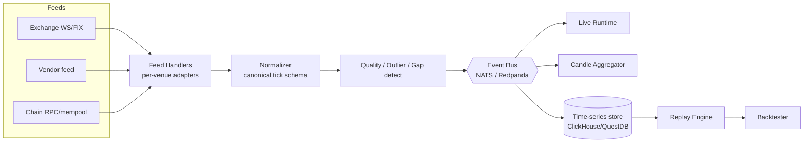

### 9.2 Ingestion & processing

- **Feed handlers** are per-venue adapters that translate native protocols to a canonical `Tick`/`BookUpdate` schema. They normalize timestamps to a single monotonic clock and tag with sequence numbers.
- **Multi-feed redundancy:** A/B feeds per venue; the normalizer dedupes by `(venue, seq)` and fails over on staleness.
- **Quality validation:** outlier detection (price jump beyond N×ATR or crossed book), gap detection (missing sequence numbers → trigger recovery), and quarantine of bad ticks (never silently dropped — logged).
- **Clock sync:** PTP/NTP on hosts; per-feed skew measured and recorded; backtests use exchange timestamps, live uses receive timestamps, both retained.
- **Gap recovery:** on detected gap, request snapshot + replay from the venue's recovery channel; mark the affected window as degraded so strategies can choose to halt.

### 9.3 Storage tiering

| Tier | Store | Use |
|---|---|---|
| Hot (μs) | In-process memory (Go maps/ring buffers) + Redis | live state, latest book, recent ticks |
| Warm (recent) | ClickHouse (SSD) | intraday queries, dashboards |
| Cold (history) | ClickHouse on object storage / Parquet | backtests, research, ML training |

**Compression:** columnar + delta-of-delta for timestamps, Gorilla/double-delta for floats → 10–20× on tick data. Cold tier in Parquet/ZSTD on object storage for cheap retention.

### 9.4 Datastore roles (mandated stack)

Stretus standardizes on **three stores**, each with one job — don't make one store do all three:

| Store | Role |
|---|---|
| **ClickHouse** | All time-series & analytics: ticks, bars, features, backtest results, decision-record analytics. High-throughput batched ingest from the Ingestion service; huge analytical scans for backtests. |
| **PostgreSQL** | Relational source-of-truth: tenants, users, strategies (orders-of-record), risk policies, marketplace, compliance, audit. Row-level security enforces tenant isolation (§21.5). |
| **Redis** | Cross-service hot cache + light pub/sub: latest book, session aggregates, warm-standby shadow, rate-limit counters. Per-tenant key prefixes. |

ClickHouse replaces the earlier QuestDB live-tick lane: a single columnar store handles both the live-capture and research lanes, simplifying ops; the hot, sub-millisecond path lives in in-process memory + Redis, not in the time-series DB.

### 9.5 Streaming/log: Kafka

| | **Kafka** | (single-binary mode) |
|---|---|---|
| Role | Durable, replayable event log; market-data fan-out; async job hand-off (AI/backtest); alert stream | In-process Go channel `EventBus` |
| When | Distributed / multi-tenant deployments | Dedicated single-binary / edge |

**Recommendation:** **Kafka** is the durable streaming backbone "where needed" — i.e. in distributed mode for the event log, market-data fan-out, and async work queues between services. Synchronous request/response stays on **gRPC**, not Kafka. In single-binary mode the `EventBus` interface is implemented by buffered Go channels, so no Kafka is required for low-cost/dedicated deployments (§20.1, §21.4).

---

## 10. Dynamic Universe & Runtime Asset Discovery

Many production strategies never name an instrument — they name a *rule for choosing instruments*. *"Trade the top 20 NSE stocks by relative volume after the first hour."* The asset set is a **runtime-resolved, time-varying function of market state**, not a constant. This is a first-class subsystem, not a query bolted onto the engine.

### 10.1 Conceptual model

A **Universe** is a function `U: (clock, market_state, params) → ordered set of InstrumentId`. It is re-evaluated on a declared cadence. A strategy binds to a Universe rather than (or in addition to) explicit instruments; the engine instantiates/retires per-instrument strategy sub-actors as the universe membership changes.

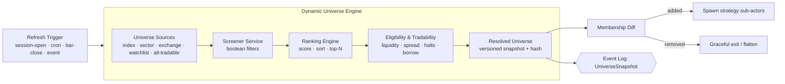

### 10.2 Components

| Component | Responsibility | Notes |
|---|---|---|
| **Universe Sources** | The candidate pool: an index (NIFTY 50), a sector (NSE:IT), an exchange (all NSE equities), a watchlist, a static list, or "all tradable on venue X" | Sources are themselves cached, refreshed on corporate-action/listing events |
| **Screener Service** | Apply boolean *filters* (volume ≥ 2× 20-day avg, price > VWAP, spread < X bps) | Filters are the same predicate nodes used in entries (§6) — one implementation |
| **Ranking Engine** | Compute a score per candidate, sort, take top-N / quantile | Scores: relative strength vs benchmark, relative volume, momentum, composite multi-factor |
| **Eligibility / Tradability** | Hard gates independent of alpha: is it halted, borrowable (for shorts), above min ADV, spread acceptable, not in a circuit limit | Fail-closed: ineligible → excluded regardless of rank |
| **Runtime Asset Resolver** | Produces the versioned, hashed universe snapshot and emits the membership diff | Snapshot hash → reproducible backtests of dynamic strategies |

### 10.3 Refresh cadence & session awareness

Refresh is **declared**, not implicit, because cadence drives both correctness and cost:

| Cadence | Use | Cost control |
|---|---|---|
| `on_session_open(+offset)` | "after the first hour" → fire at open+60m | Single evaluation/day |
| `cron` (daily/weekly/monthly) | SIP, sector rotation, 52-week scans | Off-hours batch |
| `every(N bars)` | intraday momentum refresh | Throttled, incremental |
| `on_event(news/halt/listing)` | reactive eligibility changes | Event-driven |

The resolver is **session-aware**: it knows each venue's calendar, half-days, and pre/post-market windows, so "first hour" means the venue's actual first trading hour, and a universe never includes an instrument outside its tradable session.

### 10.4 DSL for universes

```yaml
strategy "intraday_rvol_breakout":
  universe:
    source: { index: NSE:NIFTY500 }
    refresh: on_session_open(offset=60m)         # after first hour
    screen:                                       # filters (boolean)
      - rvol(20) >= 2.0                            # rel. volume vs 20-day avg
      - close > vwap()
      - spread_bps() < 5
    rank:
      by: rvol(20)
      order: desc
      take: 20                                     # top-20
    eligibility:                                   # hard gates
      min_adv_inr: 50_00_00_000                    # ₹50 cr avg daily value
      tradable: true
      not_in_circuit: true

  # per-instrument logic applies to every resolved member:
  inputs:
    fh_high: session_range_high(first_minutes=60)
  signals:
    breakout: close > fh_high and volume >= 2 * sma(volume, 20)
  rules:
    - when breakout -> enter long
        size: equal_weight(capital, max_positions=20)
        stop: pct(0.5); take_profit: pct(1.0)
    - at session_close(-2m) -> close all          # square off intraday
```

### 10.5 Backtest semantics for dynamic universes (the bias trap)

Dynamic universes are where **survivorship and look-ahead bias** silently destroy backtests. The architecture forces correctness:

- The screener/ranker may only read data with timestamp `≤ resolution_time`. The resolver runs *inside* the event-driven replay clock — it cannot peek forward (enforced by the same no-look-ahead guard as indicators, §14.2).
- Universe sources are **point-in-time**: the constituent list of NIFTY 500 *as it was on that date*, including delisted/merged names, sourced from a historical membership table (§26). A naive "current constituents" join is rejected by the survivorship-bias test (§30).
- Every `UniverseSnapshot` is logged with its hash, so a dynamic-universe backtest is exactly reproducible and a live run can be replayed.

### 10.6 Membership churn & actor lifecycle

When a member enters the universe, the engine spawns a per-instrument sub-actor (warming up its indicators from history so it doesn't trade blind). When a member exits, policy decides: *flatten-and-retire* (default for intraday) or *hold-until-exit-signal-then-retire* (for swing). This is supervised by the same actor tree (§11), with churn rate-limited to avoid spawn storms.

---

## 11. Strategy Execution Engine

This is the heart. Design priorities, in order: **determinism → isolation → low latency → throughput**.

### 11.1 Core model: supervised actors over a single-writer event loop

Each running strategy is an **actor** owning its state exclusively (single-writer principle → no locks on hot state). Actors are scheduled onto a small pool of pinned worker threads. Market events are fanned out to subscribed actors.

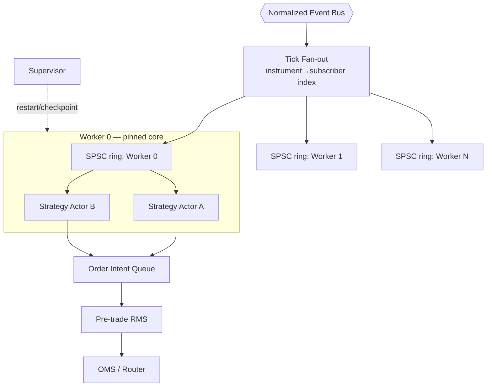

### 11.2 Why actors + DAG (not threads-per-strategy, not pure microservices)

- **Threads per strategy** doesn't scale to 100k strategies (context-switch storms, memory).
- **A microservice per strategy** adds network + serialization latency to the hot path — fatal for trading and absurd at scale.
- **Actors on a pinned worker pool**: thousands of lightweight actors share a few cores; each actor internally runs its **execution DAG** (from §4) over incoming events. Best of both: isolation without per-entity OS threads or network hops.

### 11.3 The per-actor tick loop

Each strategy actor is a goroutine that owns its state and reads events from its own channel — single-writer, so no locks on hot state. Worker goroutines can be pinned with `runtime.LockOSThread` on latency-sensitive shards.

```go
// Strategy actor goroutine; single-threaded over its own state.
// Returns order intents, each carrying the decision record that explains it (§12.5).
func (a *Actor) OnEvent(ev *core.Event) []oms.OrderIntent {
    // 1. Update stateful source/indicator nodes in topological order (event-ordered).
    a.dag.Feed(ev)                       // ring buffers, in-place, pooled — no per-tick alloc
    // 2. Evaluate stateless expression/signal nodes (branch-light).
    snap := a.dag.EvalSignals()          // returns evaluated node values for THIS bar
    // 3. Fire rules whose triggers are newly true; apply guards.
    intents := a.intentPool.Get()        // sync.Pool to avoid GC churn
    for _, rule := range a.dag.Fireable(snap) {
        if intent, ok := rule.Act(&a.position, a.params); ok {
            // capture WHY: the exact node values + predicate results behind this decision
            intent.Decision = a.dag.SnapshotDecision(rule, snap)   // §12.5
            intents = append(intents, intent)
        }
    }
    return intents                        // handed to OMS lane; no I/O here
}
```

Key properties: **no I/O, no locks, allocation-minimized** (`sync.Pool`, pre-sized buffers) inside `OnEvent`. Order *intents* are produced and pushed to the OMS lane over a channel; the actor never blocks on the network. Crucially, every intent leaves the engine already carrying its **decision record** — the evaluated variables that justify the entry or exit — so explainability is captured at the moment of decision, not reconstructed later.

### 11.4 Concurrency & memory techniques (Go)

| Technique | Where | Payoff |
|---|---|---|
| **Single-writer goroutine per actor** | all strategy state | no locks on hot state |
| **Buffered channels (SPSC-style)** | fan-out → worker, intent → OMS | clean handoff, natural backpressure |
| **`runtime.LockOSThread` + GOMAXPROCS** | latency-sensitive worker goroutines | reduced scheduler jitter, core affinity |
| **`sync.Pool` + pre-sized ring buffers** | events, intents, indicator state | minimal GC pressure, bounded memory |
| **Value semantics for hot structs** | events/intents | fewer heap escapes, cache-friendly |
| **Batched indicator eval** (SIMD via asm kernels where justified) | indicator/expr eval across nodes/instruments | amortized per-tick cost |
| **`GOGC` / soft memory limit tuning** | per-shard | predictable GC, sub-ms STW |
| **Bounded channels = backpressure** | every queue | overload sheds/halts, never OOMs |

### 11.5 Backpressure & overload

Every queue is bounded. On sustained overload the policy is explicit and per-tier:
- **Conservative (default):** halt affected strategies to flat/hold, raise alert. *Fail closed.*
- **Drop-oldest (HFT/market-data only):** for stale book updates where only the latest matters.
Never silently buffer unboundedly — that turns a latency spike into an OOM and a mass liquidation.

### 11.6 State, snapshotting, checkpointing, recovery

Because each node declares its `StateSpec` (§4.3), the engine knows exactly what to persist.

```mermaid
sequenceDiagram
    participant A as Strategy Actor
    participant LOG as Event Log (Kafka)
    participant CK as Checkpoint Store
    participant SB as Warm Standby

    loop every N events / T seconds
        A->>CK: snapshot(declared state + last_event_offset)
    end
    Note over A: crash / node fails
    SB->>CK: load latest snapshot
    SB->>LOG: replay events since snapshot.offset
    SB->>SB: deterministic catch-up to live
    SB-->>A: promoted to active; reconcile open orders w/ broker
```

- **RPO ≈ 0:** state is a fold over the durable log; worst case is replay from last snapshot.
- **RTO < 5 s:** warm standby already near-live; only the delta replays.
- **Order reconciliation on promotion:** idempotent client order IDs let the new active query the broker and adopt in-flight orders rather than duplicating them.

### 11.7 CEP & rule engine

Beyond per-strategy DAGs, a **Complex Event Processing** layer handles cross-event patterns ("3 failed breakouts within 10 minutes", "earnings event then IV crush"). Implemented as windowed pattern automata over the event stream — themselves stateful DAG nodes, so they inherit checkpointing.

### 11.8 GPU optionality

GPU is *never* on the order hot path. It is offered for: large vectorized backtests, ML inference batches, and portfolio-wide optimization. The DAG marks `ml_signal`/`rl_policy` nodes; if a GPU is present and the batch is large enough, those nodes route to a GPU inference service; otherwise CPU. Strategies remain correct either way.

### 11.9 Language choice for the runtime

The runtime is **Go**, consistent with the rest of the platform (§21.1). The honest tradeoff and how it's managed:

| Concern | Reality with Go | Mitigation |
|---|---|---|
| GC pauses | Sub-ms, typically tens of µs STW (Go 1.21+) | Allocation discipline (§11.4): `sync.Pool`, pre-sizing, value semantics, `GOGC`/soft-limit tuning |
| Scheduler jitter | Goroutine scheduler adds small jitter | `runtime.LockOSThread` + pinned `GOMAXPROCS` on hot shards |
| No manual memory layout | Less control than Rust/C++ | Keep hot structs flat & pooled; avoid interface boxing on the hot path |
| Extreme HFT (µs wire-to-wire) | Go is *not* ideal here | Isolate that single strategy class in a native co-process exposing the same OMS gRPC contract (§21.7) — not a platform rewrite |

For everything from SIP and swing strategies to intraday and most crypto/equity algos, Go comfortably meets the latency budget (strategy-graph eval in the low-µs range, internal OMS overhead well under the targets in §3.1) while giving the team one language, one binary, fast builds, and easy hiring — the right call for a B2B product. The earlier Rust-core recommendation is explicitly superseded by this product decision.

**WASM plugins:** **wazero** (pure-Go, no cgo) with fuel metering + memory limits sandboxes untrusted custom indicators/risk modules. Plugins run *inside* the actor's node graph but cannot escape the sandbox, allocate unbounded, or loop forever (fuel limit) — see §19.

---

## 12. Order Management System (OMS)

### 12.1 Order lifecycle

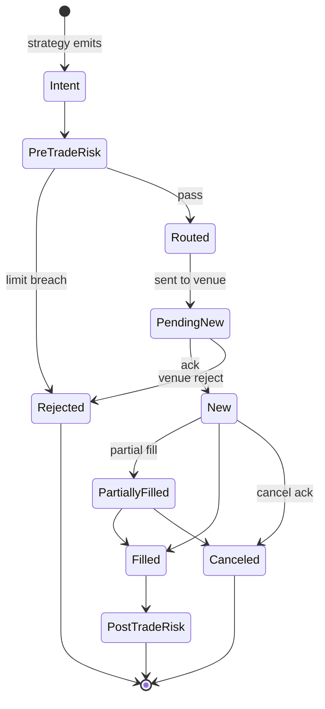

Every transition is an event in the log (auditability + recovery). Client order IDs are **idempotent and deterministic** (`hash(strategy_id, seq)`) so retries and failover never double-send.

### 12.2 Broker abstraction layer

```go
type BrokerAdapter interface {
    Place(ctx context.Context, o NormalizedOrder) (BrokerOrderID, error)
    Cancel(ctx context.Context, id BrokerOrderID) error
    Modify(ctx context.Context, id BrokerOrderID, c Modify) error
    Capabilities() BrokerCaps          // supports OCO? iceberg? FIX? max msg rate?
    SubscribeFills(ctx context.Context) (<-chan Fill, error)
}
```

The **paper-trading adapter (§15) implements this exact interface** — the only thing swapped between paper and live.

Adapters: Binance (WS), Coinbase, Zerodha Kite (REST/WS), IBKR (TWS/Gateway), CME & institutional venues (FIX 4.2/4.4/5.0 SP2), DEX routers (sign + submit on-chain). **REST is fallback only**; WS/FIX are primary. The OMS reads `capabilities()` and *synthesizes* unsupported order types locally (e.g., if a venue lacks native OCO, the OMS emulates it by managing two orders and canceling the sibling on fill).

### 12.3 Smart Order Routing (SOR)

For multi-venue instruments (crypto especially), SOR splits orders by available liquidity, fees, and expected slippage; respects venue rate limits; and falls back across venues on rejection. Algorithmic execution — **TWAP, VWAP, POV, Iceberg** — runs as *execution strategies* (themselves small DAGs) that slice a parent order into children over time.

### 12.4 Order types & resilience

- **Bracket / OCO / trailing** — native if supported, else OMS-synthesized.
- **Partial fills** — accumulated into position state; child orders sized against remaining qty.
- **Slippage handling** — limit-with-protection by default; configurable max slippage → reject rather than chase.
- **Retry policy** — exponential backoff with jitter on transient errors; *hard stop* on risk-relevant errors (never blindly retry a rejected-for-margin order).
- **Broker failover** — on adapter health failure, route to a configured alternate venue/account; reconcile positions first.

### 12.5 Order Decision Record — entry/exit explainability

**Every order carries a `DecisionRecord`** capturing exactly *why* it was created: which rule fired, and the evaluated value of every variable, indicator, and sub-condition that the entry or exit predicate depended on, at the bar that triggered it. This is captured at decision time inside the engine (§11.3) — not reconstructed — so it is exact and tamper-evident (it's part of the event log). It is what lets a user, on the UI, open any order and see the full chain of reasoning behind a complex strategy.

Because the DSL lowers to a DAG of named predicate/indicator nodes (§4, §6), the decision record is a natural by-product: for the firing rule, the engine walks the predicate's dependency sub-graph and emits each node's `(name, params, value, result)` plus the comparison that made the rule true.

```go
type DecisionRecord struct {
    OrderID     string
    StrategyID  string
    RuleName    string          // e.g. "long_entry"
    Kind        string          // "entry" | "exit"
    BarTime     time.Time
    Instrument  string
    // Every variable behind the decision, in evaluation order:
    Terms []DecisionTerm
    Outcome   string            // "fired" + the human sentence (for the UI "why" panel)
}

type DecisionTerm struct {
    Expr     string             // "close > bb.upper"
    Operands []Operand          // resolved values of each operand
    Result   bool               // or numeric, for sizing terms
}
type Operand struct {
    Name   string               // "close", "bb.upper", "ema_200", "rvol(20)"
    Params map[string]any       // {"period":20,"mult":2.0}
    Value  float64
}
```

**Worked example** — for the ETH strategy (§27), a long entry's decision record reads (rendered on the UI "why" panel):

| Term | Operands (value) | Result |
|---|---|---|
| `compressed` | `bbwidth=0.018` == `lowest(bbwidth,20)=0.018`; `atr14=11.2` == `lowest(atr14,20)=11.2` | ✅ true |
| `close > bb.upper` | `close=2410.5`, `bb.upper=2402.1` | ✅ true |
| `volume >= 1.5×avg` | `volume=18,300`, `1.5×sma(vol,20)=15,900` | ✅ true |
| `close > ema200` | `close=2410.5`, `ema200=2358.0` | ✅ true |
| `no_news` | `news_blackout(HIGH,±30m)=false` | ✅ clear |
| **sizing** | `risk_pct=1%`, `stop=1.5×atr=16.8`, `qty=solve(...)=2.4 ETH` | qty=2.4 |

The exit order gets an equivalent record (e.g. *"trail stop crossed: price 2370.0 < EMA20 2374.2 after +2R reached"*). Exits and entries are symmetric — both fully explained.

**Plumbing:** the record is attached to the `OrderIntent`, persisted with the order (Postgres `orders.decision JSONB` and a ClickHouse `decision_terms` table for analytics, §26), emitted on the event log, and **streamed to the React UI** (§21.8) so the blotter's "why" panel updates live as orders fire. This directly serves the requirement that a user can understand every variable behind every entry and exit, including for complex multi-condition strategies.

---

## 13. Risk Management System (RMS)

The RMS is **synchronous and on the critical path** — it sits between order intent and the venue. It must be fast (microseconds) and *cannot* be bypassed.

### 13.1 Hierarchical control planes

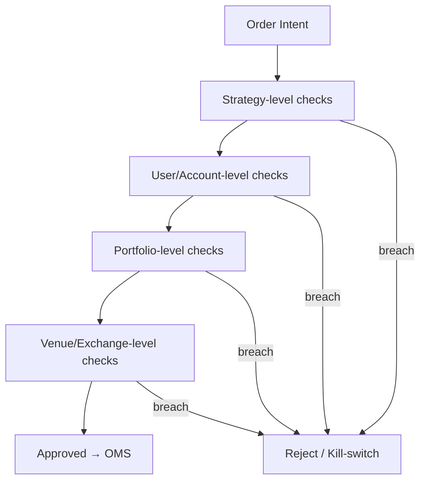

Each level can independently veto. Limits cascade: a strategy cannot exceed its allotment, the account cannot exceed the sum across strategies, the portfolio enforces aggregate exposure, the venue layer enforces exchange/regulatory caps.

### 13.2 Checks

| Pre-trade (sync, hot path) | Post-trade (async, continuous) |
|---|---|
| Position & exposure limits | Real-time PnL & drawdown tracking |
| Max order size / notional | Portfolio VaR (historical + parametric) |
| Margin / buying-power check | Concentration & correlation monitoring |
| Fat-finger / price-collar check | Daily-loss circuit breaker |
| Self-trade / wash prevention | Greeks aggregation (options books) |
| Rate-limit / message-throttle | Stress / scenario re-evaluation |

### 13.3 Kill switches & circuit breakers

- **Per-strategy kill:** trips on max daily loss, anomalous fill rate, or detector alert → flatten or hold per policy.
- **Account/portfolio kill:** trips on aggregate drawdown or VaR breach → halt new orders, optionally flatten.
- **Global kill (the big red button):** operator-triggered or auto on systemic anomaly (feed loss, venue outage) → cancel-all + halt. This path is hardened, tested, and *cannot* depend on the AI layer.

### 13.4 Sizing & leverage

- `risk_pct(capital, x)` sizing solves position size from stop distance so each trade risks exactly x% — the DSL primitive that makes "risk 1% per trade" precise.
- **Volatility-adjusted sizing:** ATR/realized-vol scales size down in turbulent regimes.
- **Dynamic leverage:** capped per instrument and per regime; RMS reduces allowable leverage as drawdown grows (de-risking ladder).

---

## 14. Backtesting & Simulation

### 14.1 One engine, swappable event source

Per §4.6, backtest and live share the *exact* execution code. The backtester is just the engine fed from the **Replay Engine** instead of the live bus, plus a **simulated matching layer** instead of a broker adapter.

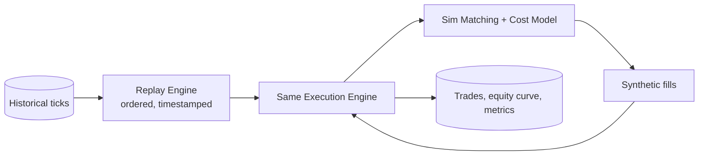

### 14.2 Fidelity models

- **Event-driven, tick-level:** processes every tick in order — no look-ahead, the cardinal sin of naive backtesters.
- **Latency simulation:** inject realistic order→ack and data→engine delays so a strategy that only works at 0 latency is exposed.
- **Slippage & liquidity:** fills modeled against book depth / volume; large orders walk the book; partial fills realistic.
- **Cost model:** fees, funding, borrow, spread — per venue.

### 14.3 Determinism & scale

- **Deterministic reproducibility:** `(strategy_hash, data_hash, config_hash) → identical results`. Seeds for any stochastic component are pinned and logged.
- **Parallelism:** parameter sweeps shard across cores/nodes (embarrassingly parallel — each combo is independent). Cache warm indicator computations shared across combos that differ only in downstream params.
- **Distributed backtesting:** a coordinator splits the (param × period × instrument) space; workers pull tasks; results aggregate to the warehouse.
- **Monte Carlo & walk-forward:** randomized trade-order / bootstrap for robustness; rolling in-sample/out-of-sample windows to expose overfitting.

---

## 15. Paper Trading Subsystem (First-Class)

Paper trading is **not** a simplified simulator. It runs the *identical* DSL → compiler → IR → execution DAG → OMS → RMS → portfolio → monitoring → analytics stack as live. **Only the execution adapter is swapped** — a `PaperBrokerAdapter` implementing the same `BrokerAdapter` trait (§12.2) replaces the real venue adapter. This is the single most important property: what you validate in paper is what you run in production, byte-for-byte in the decision path.

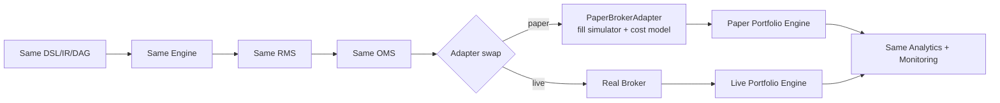

### 15.1 Modes

| Mode | Data source | Use |
|---|---|---|
| **Market replay** | Historical ticks via Replay (§14) | Fast deterministic validation against known history |
| **Live-market paper** | Live bus, simulated fills | Real-time behavior without capital |
| **Forward testing** | Live data, time-forward, no peeking | Out-of-sample proof a backtest wasn't curve-fit |
| **Multi-broker paper** | Live data per venue, venue-specific fill models | Validate SOR/failover across venues |
| **Multi-account paper** | Many simulated accounts, one strategy | Capacity / scaling behavior |
| **Marketplace paper** | Subscriber paper-trades a listed strategy | Try-before-buy; generates the verifiable track record (§18.5) |
| **Team/org shared paper** | Shared paper accounts, RBAC | Collaborative evaluation, training |

### 15.2 Fill simulation (realistic, per order type)

The `PaperBrokerAdapter` models the microstructure that determines whether a strategy is actually viable:

| Order type | Simulated behavior |
|---|---|
| Market | Fill walks the simulated book; spread + slippage applied |
| Limit | Filled only when market trades through *and* simulated **queue position** is reached |
| Stop / Stop-limit | Triggered on touch; converts to market/limit with realistic gap-through on fast moves |
| Bracket / OCO | Parent+children managed; sibling cancel on fill (same logic as live OMS synthesis) |
| Iceberg | Visible/hidden slices; refill behavior modeled |

Cross-cutting models: **spread**, **slippage** (size vs book depth), **partial fills**, **queue-position** (FIFO estimate from book + trade tape), **liquidity** (depth-limited fills), **exchange-specific behavior** (tick/lot, rate limits), **maker/taker fees**, **funding fees** (perps), **borrow costs** (shorts), **contract expiry/settlement** (futures/options). These are the same cost models the backtester uses (§14.2), so backtest ↔ paper ↔ live cost assumptions are consistent.

### 15.3 Paper portfolio engine

Tracks, in real time and identically to live: realized PnL, unrealized PnL, portfolio value, drawdown, gross/net exposure, **Greeks** (for options books), margin utilization, and the full RMS risk-metric set. Because it's the same portfolio engine, portfolio-level limits and kill switches (§13) are exercised in paper too.

### 15.4 Analytics

Per strategy and per portfolio: win rate, profit factor, Sharpe, Sortino, Calmar, expectancy, average trade duration, **Maximum Adverse Excursion (MAE)** and **Maximum Favorable Excursion (MFE)** distributions, slippage analysis (modeled vs realized), and strategy attribution (PnL decomposed by signal/instrument/regime).

### 15.5 Validation & the deployment ladder

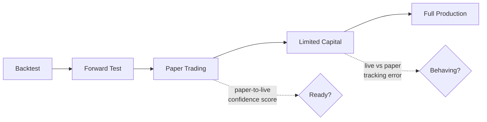

- **Paper-to-live confidence score:** compares paper fills/PnL distribution to the backtest (and, post-deploy, paper vs limited-live) — large divergence flags an unrealistic cost model or regime shift.
- **Strategy readiness score:** composite of out-of-sample stability, drawdown within tolerance, sufficient trade count for significance, and fill realism. Below threshold → not promotable.
- **Capital recommendation engine:** suggests starting capital from strategy capacity (liquidity/ADV constraints), volatility, and risk budget — not a guess.
- **Deployment approval workflow:** promotion across each ladder rung is an authorized, audited action (RBAC: a trader proposes, a risk-admin approves), with automatic rollback if live tracking error vs paper exceeds tolerance.

> **Why this matters architecturally:** because paper and live share everything except the adapter, the confidence/readiness scores are measuring *real* engine behavior, not a toy. A strategy that survives the ladder has been validated by the exact code that will trade it.

---

## 16. Optimization & AI-Assisted Research

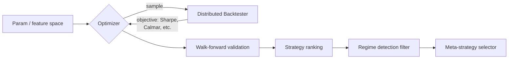

| Method | Use |
|---|---|
| **Bayesian optimization** | Sample-efficient param tuning (expensive backtests) |
| **Genetic algorithms** | Large/discrete spaces, rule structure search |
| **Reinforcement learning** | Execution policy & position sizing (bounded by RMS guards) |
| **AutoML for trading** | Pipeline search over features + models, guarded against leakage |
| **Feature engineering** | Library of microstructure, vol, sentiment features as DAG nodes |
| **Regime detection** | HMM / changepoint → strategies gate on regime |
| **Meta-strategy selection** | Allocate capital across strategies by recent regime-conditioned performance |

**Overfitting is the enemy.** Every optimization result is mandatorily walk-forward validated and penalized for complexity; the platform surfaces deflated Sharpe / probability-of-backtest-overfitting so users distrust curve-fits. RL/AutoML outputs are *candidate parameters* — they still pass the §7 verifier and §13 RMS before live deployment.

---

## 17. SIP & Recurring Investment Engine

Recurring/scheduled investing is a different execution paradigm from signal trading: time-triggered, cash-flow driven, multi-period, and heavily compliance/consent gated. It reuses the OMS/RMS/portfolio engine but adds a scheduler and a cash-flow planner.

### 17.1 Architecture

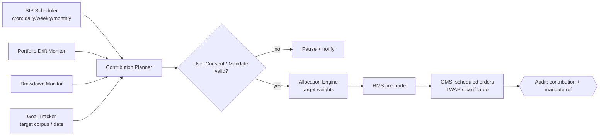

### 17.2 SIP variants

| Variant | Logic |
|---|---|
| **Fixed recurring buy** | Invest fixed amount `A` on schedule across target weights |
| **Dynamic SIP (buy-the-dip)** | `A' = A * f(drawdown)`; e.g. 2× when portfolio DD > 15% |
| **Value averaging** | Target portfolio *value* grows by `V` each period; invest `target_value − current_value` (buy more when down, less/sell when up) |
| **Goal-based** | Solve required periodic contribution to hit corpus by date given expected return; re-plan as actuals diverge |
| **Asset-allocation rebalance** | Restore target weights on schedule or on drift |
| **Drift-based rebalance** | Rebalance only when any weight deviates > band (e.g. ±5%) — reduces churn/taxes |
| **Risk-adjusted deployment** | Scale contribution by regime/volatility (deploy more in calm, throttle in stress) |

### 17.3 DSL

```yaml
strategy "etf_value_averaging_sip":
  type: recurring
  universe: { basket: [NSE:NIFTYBEES, NSE:GOLDBEES, NSE:JUNIORBEES] }
  schedule: monthly(day=1, time="10:00", tz="Asia/Kolkata")
  cashflow:
    method: value_averaging
    base_contribution_inr: 25000
    dynamic:
      when: portfolio_drawdown() > 0.15
      multiply_contribution: 2.0
  allocation:
    target_weights: { NIFTYBEES: 0.5, GOLDBEES: 0.25, JUNIORBEES: 0.25 }
    rebalance: quarterly(drift_band=0.05)
  compliance:
    mandate_required: true            # e-mandate / standing instruction
    user_consent: explicit
  execution:
    slice: twap(window=15m)           # avoid market impact on the open
```

### 17.4 Consent & compliance workflow

SIP touches recurring debits and (in many jurisdictions) advisory boundaries, so it is consent-gated:

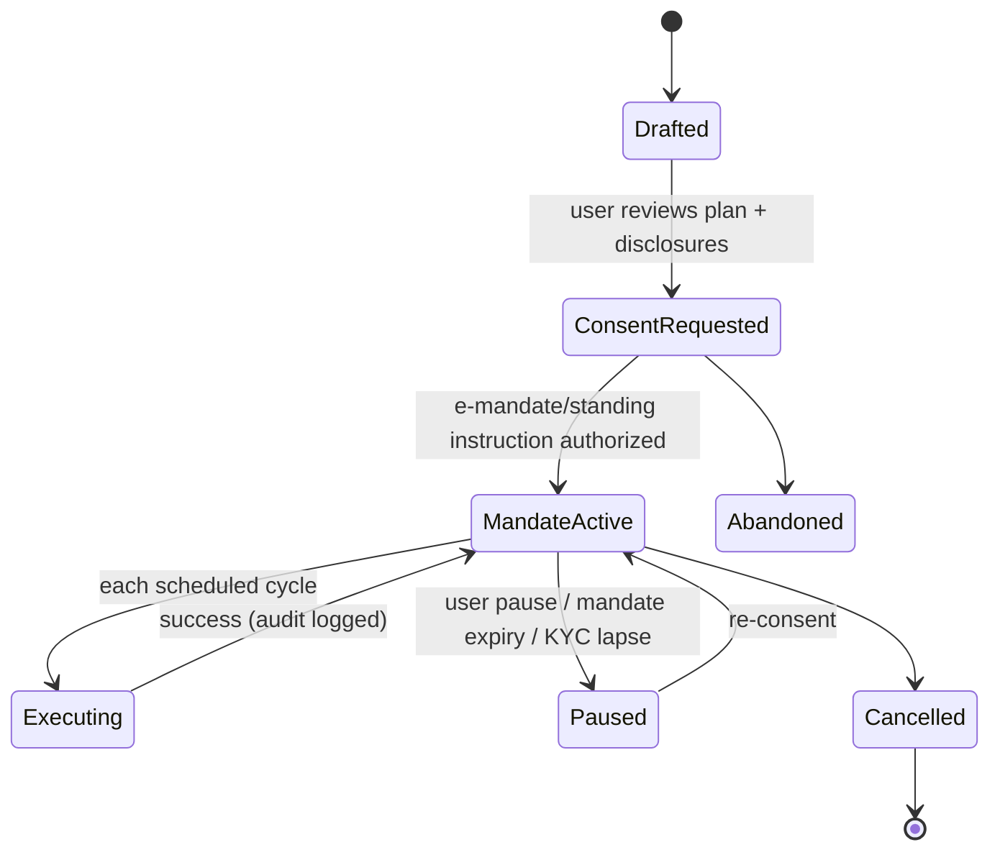

Every contribution links to the mandate id and consent version in the immutable audit log (§26). A lapsed mandate or KYC fail-closes the schedule (pause, notify) rather than silently transacting.

---

## 18. Strategy Marketplace & Compliance-Aware Publishing

The marketplace turns strategies into shareable, licensable artifacts — but publishing a strategy that others trade real money on is a **regulated act** in most jurisdictions. The architecture treats compliance as a gating workflow, not a checkbox.

### 18.1 Components

```mermaid
flowchart TB
    AUTHOR[Creator] --> SUBMIT[Submit listing<br/>strategy_hash + metadata]
    SUBMIT --> CLASS[Strategy Classifier]
    CLASS --> ELIG[Publisher Eligibility Check]
    ELIG --> JUR[Jurisdiction Rule Engine]
    JUR --> REVIEW[Compliance Approval Workflow]
    REVIEW -->|approved| LIST[Listed: profile · pricing · disclosures]
    REVIEW -->|rejected| BACK[Back to creator + reasons]
    LIST --> SUB[Subscriber]
    SUB --> LIC[Licensing / Subscription]
    LIC --> CLONE[Clone or Subscribe<br/>signal | execution | copy]
    LIST --> PERF[Live + backtest performance disclosure]
    LIST --> RISK[Risk score]
    LIST --> REV[Reviews / reputation]
    SUBMIT & REVIEW & LIC --> AUD{{Immutable audit log}}
```

### 18.2 Strategy classification (drives the compliance path)

The classifier assigns a category that determines what review/eligibility is required — because the regulatory weight differs enormously:

| Class | What it is | Typical regulatory weight |
|---|---|---|
| **Educational template** | Illustrative, not for live capital | Lowest — disclaimers only |
| **Signal strategy** | Emits alerts; user decides | Moderate — signal/research disclosures |
| **Execution automation** | Auto-trades the subscriber's own account | Higher — execution + suitability disclosures |
| **Advisory strategy** | Constitutes investment advice | High — publisher must be a registered/eligible person |
| **Managed-account-like** | Discretionary management of others' capital | Highest — typically requires licensing; gated hardest |

### 18.3 Publisher eligibility & jurisdiction-aware rules

- **Publisher eligibility verification:** before a creator can list a *regulated* class (advisory/managed), the platform verifies registration (e.g., an investment adviser / research-analyst registration in the relevant jurisdiction) against an eligibility record, with document/credential capture and expiry tracking.
- **Jurisdiction rule engine:** rules are data, not code — a per-jurisdiction policy maps `(strategy_class, asset_class, target_audience) → {allowed, required_credentials, mandatory_disclosures, restrictions}`. A strategy listed to users in jurisdiction X is evaluated against X's policy. This keeps the engine generic while the legal mapping is maintained by compliance (the platform provides *mechanism*; the jurisdiction policy is the *policy*).
- **Disclaimers & classification** are attached to every listing and versioned; subscribers must acknowledge them (acknowledgment logged).

### 18.4 Compliance approval workflow (state machine)

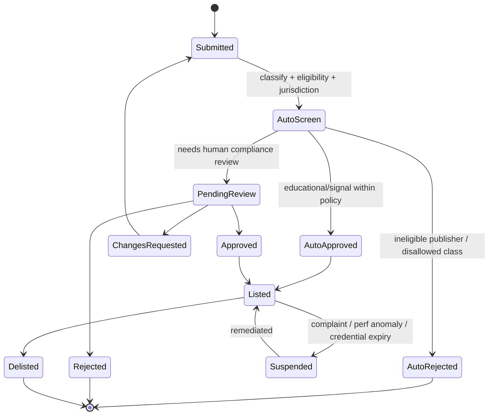

Every transition (who, when, decision, rationale, policy version) is written to the **immutable, hash-chained audit log** (§22, §26). Listing, certification, subscription, and disclosure acknowledgments are all auditable events — essential for a regulator request.

### 18.5 Performance disclosure & risk score (anti-cherry-picking)

- **Backtest disclosure** must include the data window, costs assumed, and a mandatory "past performance" disclaimer; the platform recomputes the backtest from the pinned `strategy_hash` to prevent doctored numbers.
- **Live performance disclosure** is sourced from *platform-recorded* paper/live results (§15), not creator-supplied screenshots — so the track record is verifiable.
- **Risk score** is computed by the platform (max drawdown, leverage, tail risk, strategy class) and shown prominently; it cannot be edited by the creator.

### 18.6 Licensing, revenue share, tenant enablement

- Licensing models: one-time, subscription, or revenue-share; enforced at deploy time (a subscriber can run the strategy only while licensed; the artifact is hash-pinned so they get exactly the certified version).
- **Tenant-level enablement:** an org admin can allow/deny the marketplace, or whitelist only certified strategies of certain classes/asset types for their users.
- **Certification workflow:** a stronger badge than "listed" — passing extended review (code/plugin audit for WASM components, stress backtests, live-track-record minimums). Certification is itself a logged, expiring credential.

---

## 19. Plugin & Extensibility Architecture

### 19.1 Two extension tiers

| Tier | Mechanism | Trust | Use |
|---|---|---|---|
| **Sandboxed** | **WASM** (`wasmtime`) | Untrusted (marketplace) | Custom indicators, risk modules, signal generators, formulas |
| **Native** | Rust crate implementing an SPI trait | Trusted (vetted/first-party) | Broker adapters, feed handlers, high-perf execution algos |

### 19.2 WASM sandbox guarantees

```rust
// Host-enforced limits per plugin instance
WasmConfig {
    max_memory_pages: 256,        // hard memory cap
    fuel: 1_000_000,              // bounded execution → no infinite loops
    allowed_imports: &[GET_BAR, GET_INDICATOR, EMIT_SIGNAL],  // capability-scoped
    no_network: true,
    no_filesystem: true,
    deterministic: true,          // no wall-clock, no rng unless seeded by host
}
```

A custom indicator gets read-only access to declared inputs and emits a value; it *cannot* place orders, read other strategies, do I/O, or escape its fuel/memory budget. This is what makes a third-party marketplace safe to run on shared infrastructure.

### 19.3 SDK & multi-language

- WASM target means plugins can be authored in **Rust, AssemblyScript, C, TinyGo, Zig** — anything that compiles to WASM with the capability ABI.
- SDK ships the ABI definitions (the `allowed_imports`), test harness, and a local sim so authors validate before publishing.
- The DSL `custom()` node references a plugin by content hash → reproducibility extends to plugins.

---

## 20. Scalability Architecture

### 20.1 One Go codebase, two deployment shapes

Stretus is built in Go as a set of **modules behind interfaces**. The same modules compile into either (a) a **single static binary** — every module linked in one process, communicating over in-process Go channels — for low-cost / dedicated-client deployments, or (b) a **distributed mesh** of ≤10 services talking over gRPC, for institutional scale. The module boundaries are identical in both shapes; only the transport between them changes (in-process channel vs gRPC). This is exactly the property Go makes cheap: a static binary with no runtime to ship, and interfaces that abstract whether the peer is a goroutine or a remote service. The concrete service decomposition is in §21.

```mermaid
flowchart TD
    subgraph Mono[Single-binary mode — low-cost / dedicated]
      MONO[One Go process:<br/>gateway + engine + OMS + RMS + ingestion<br/>in-process channel bus · embedded/managed CH+PG+Redis]
    end
    subgraph Cluster[Distributed mode — multi-tenant / institutional]
      GW[Gateway] --> COORD[Coordinator]
      COORD --> SH1[Execution shard 1<br/>engine+OMS+RMS]
      COORD --> SH2[Execution shard 2]
      COORD --> SHN[Execution shard N]
      SH1 & SH2 & SHN --> BUS{{Kafka<br/>durable event log}}
      SH1 -.warm standby.-> SB1[Standby 1]
    end
```

### 20.2 How it scales down

| Constraint | Technique |
|---|---|
| Small VPS / dedicated single-tenant box | Single binary; in-process channel bus (no Kafka); managed or embedded ClickHouse + Postgres + Redis; AI calls go out to OpenRouter (no local GPU) or are disabled for pure-execution deployments |
| Edge / air-gapped | Static binary + systemd; Kafka and the AI microservice optional; OpenRouter swapped for a self-hosted OpenAI-compatible endpoint (e.g. vLLM) reachable on the private network |
| Laptop / dev | Same binary; backtests parallelized across local cores via goroutines |

The trick: every heavy dependency (Kafka, the AI service, GPU inference) sits **behind a Go interface** with a lightweight in-process default. The engine codes to an `EventBus` interface; it does not know whether the implementation is a buffered channel or a Kafka producer/consumer.

### 20.3 How it scales up

- **Sharding** by tenant and/or instrument: a shard owns a disjoint instrument set + the strategies trading them, minimizing cross-shard chatter.
- **Cluster coordination** via the coordinator service (HA metadata in a Raft-backed store or Postgres + advisory locks): assigns shards, manages rebalancing, tracks standbys.
- **Elastic scaling:** add shards → coordinator migrates strategies (drain → checkpoint → restore on target). Stateless services (gateway, AI, research) autoscale on Kubernetes (HPA); stateful execution shards scale deliberately (state migration is not free).
- **GC discipline on the hot path:** because Go has a garbage collector, the execution shard avoids per-event allocation — `sync.Pool` for event/order structs, pre-sized ring buffers, value (not pointer) semantics for hot structs, and `GOGC`/soft-memory-limit tuning. Modern Go STW pauses are sub-millisecond (typically tens of µs), which is well inside the latency budget for everything except the extreme HFT tier (§21.7).

---

## 21. Technology Stack, Service Decomposition & Deployment Topology

### 21.1 Mandated stack

| Layer | Choice | Rationale |
|---|---|---|
| **Backend + ingestion** | **Go** | One static binary, trivial cross-compilation, huge talent pool, excellent concurrency (goroutines/channels), strong gRPC/Kafka/ClickHouse/Postgres ecosystem. Primary language for *all* services and ingestion. |
| **Frontend** | **React** | Streaming-first UI (prices, orders, trades, positions, decision records) — see §21.8 |
| **AI** | dedicated **AI microservice** (Go) calling **OpenRouter** | Model-agnostic: switch between frontier and open-source models without code change; async chat, strategy generation, strategy evaluation, backtest orchestration |
| **Inter-service transport** | **gRPC** (everywhere internal) | Typed contracts, streaming, low overhead |
| **Edge transport** | **REST** (frontend ↔ gateway only) + WebSocket/SSE for streams | Browser-friendly; gateway translates REST/WS ↔ internal gRPC |
| **OLTP / relational** | **PostgreSQL** | Tenants, users, strategies (orders-of-record), risk policies, marketplace, audit, compliance |
| **OLAP / time-series** | **ClickHouse** | Ticks, bars, features, backtest results, decision-record analytics |
| **Cache** | **Redis** + **in-process memory** | Redis for cross-service hot/shared state; in-process maps/ring buffers for per-shard hot path |
| **Streaming / log** | **Kafka** (where needed) | Durable event log, market-data fan-out, async work hand-off; replaced by in-process channels in single-binary mode |
| **AuthN/AuthZ** | **Keycloak** (OIDC/OAuth2) | Central identity, per-tenant realms/clients, RBAC, SSO, token issuance |
| **Sandbox / plugins** | **wazero** (pure-Go WASM) | Custom indicators/risk modules sandboxed with no cgo (§19) |

> **Note on the Go latency decision.** Earlier drafts proposed Rust for the hot path on GC grounds. Go is the deliberate choice here for a B2B platform where developer velocity, operational simplicity, single-binary deployment, and hiring matter, and where the latency target is *low, not ultra-low*. Modern Go's GC (sub-ms, typically tens of µs STW) plus allocation discipline (§20.3) covers every strategy class except extreme microsecond HFT — for which a single, isolated native co-process is the escape hatch (§21.7), not a rewrite of the platform.

### 21.2 The ≤10 services

Hard constraint: **no more than 10 services total.** A service may contain many modules. Stretus uses **8 services**, leaving headroom.

| # | Service (Go) | Modules it contains | Talks to |
|---|---|---|---|
| 1 | **Gateway / BFF** | REST + WebSocket/SSE edge, Keycloak token validation, RBAC, tenant routing, rate limiting, gRPC fan-out, stream multiplexing | all (edge → internal gRPC) |
| 2 | **Ingestion** | venue feed handlers, normalizer, candle aggregator, data-quality/gap detection, Kafka producer | Kafka, ClickHouse, Execution |
| 3 | **Execution** *(stateful, shardable)* | strategy actor runtime, DSL compiler + IR/DAG, indicator engine (§5), dynamic-universe engine (§10), **OMS**, **RMS**, portfolio engine, broker adapters, paper-broker adapter (§15), checkpointing | Kafka, Redis, Postgres, broker venues |
| 4 | **AI** *(async)* | OpenRouter client, chat orchestration, strategy generation, strategy evaluation, backtest orchestration, RAG/ontology, clarification engine | OpenRouter, Execution (backtest), Postgres, Kafka |
| 5 | **Backtest/Research** | distributed backtest workers, replay engine, sim matching, optimization (Bayesian/GA/RL), walk-forward | ClickHouse, Kafka, Execution code (shared modules) |
| 6 | **Marketplace** | listings, classification, publisher eligibility, jurisdiction rule engine, compliance approval workflow, licensing/subscriptions, performance disclosure (§18) | Postgres, Execution (paper track record) |
| 7 | **Coordinator** | shard assignment, rebalancing, HA/standby tracking, tenant→shard mapping, deployment-ladder promotions | Postgres/Raft, Execution |
| 8 | **Notification/Alerts** | alert rules, webhooks, push/email, SIP scheduler triggers (§17) | Kafka, Redis, external channels |

Cross-cutting concerns (observability, audit, config) are **libraries** linked into every service, not separate services — that's how the count stays at 8.

```mermaid
flowchart TB
    FE[React frontend] -->|REST + WS/SSE| GW[1 Gateway/BFF]
    KC[(Keycloak)] -. OIDC .- GW
    GW -->|gRPC| AI[4 AI]
    GW -->|gRPC| EXq[3 Execution]
    GW -->|gRPC| MKT[6 Marketplace]
    GW -->|gRPC stream| EXq
    ING[2 Ingestion] -->|Kafka| EXq
    ING --> CH[(ClickHouse)]
    AI -->|gRPC| BT[5 Backtest/Research]
    AI --> OR[(OpenRouter)]
    BT --> CH
    EXq --> PG[(Postgres)]
    EXq --> RD[(Redis)]
    EXq -->|Kafka events| NOTIF[8 Notification]
    COORD[7 Coordinator] -->|gRPC| EXq
    classDef svc fill:#48f,color:#fff;
    class GW,ING,EXq,AI,BT,MKT,COORD,NOTIF svc;
```

### 21.3 Communication rules (enforced)

- **gRPC for every service↔service call.** Typed `.proto` contracts are the source of truth (§26). Server-streaming gRPC carries live prices/orders/positions internally.
- **REST only at the edge**, frontend ↔ Gateway. The Gateway is the *only* service exposing REST/WebSocket/SSE; it translates to internal gRPC. No other service speaks REST.
- **Kafka** for durable, async, fan-out flows (market data, event log, AI/backtest job hand-off, alerts). Synchronous request/response stays on gRPC; Kafka is for streams and work queues, not RPC.

### 21.4 Single-binary mode (low-cost / dedicated)

The same 8 modules link into **one Go executable**. A build tag / config flag selects transport:

```go
// EventBus is implemented by an in-process channel bus OR a Kafka-backed bus.
type EventBus interface {
    Publish(ctx context.Context, topic string, e Event) error
    Subscribe(topic string) (<-chan Event, func())
}
// ServiceClient (e.g. AIClient, ExecClient) is implemented by either a direct
// in-process call OR a generated gRPC client — chosen at wiring time.
```

In single-binary mode, `AIClient` is a direct function call into the AI module; in distributed mode it's a gRPC stub. Business logic is identical. This delivers the "everything in one executable for low-cost deployment" option without a second codebase. (The AI module can still call out to OpenRouter, or be compiled out entirely for pure-execution dedicated deployments.)

### 21.5 Multi-tenancy & dedicated-client deployment (B2B)

Stretus is B2B; every tenant (client org) is isolated. Two deployment models, same code:

```mermaid
flowchart LR
    subgraph Shared[Shared multi-tenant cluster]
      direction TB
      KC2[(Keycloak: realm per tenant)] --> GW2[Gateway]
      GW2 --> POOL[Execution shards<br/>tenant-tagged, quota-bounded]
      POOL --> PGT[(Postgres: tenant_id RLS)]
      POOL --> CHT[(ClickHouse: tenant_id partition)]
    end
    subgraph Dedicated[Dedicated single-tenant deployment]
      direction TB
      ONE[One Stretus instance<br/>single-binary or full mesh] --> OWN[(Own PG/CH/Redis/Kafka)]
    end
```

| Aspect | Shared multi-tenant | Dedicated client |
|---|---|---|
| Identity | One Keycloak, **realm per tenant** | Tenant's own Keycloak realm or instance |
| Data isolation | `tenant_id` on every row + **Postgres row-level security**; ClickHouse partitioned by `tenant_id`; Redis key-prefixed per tenant | Physically separate datastores |
| Compute isolation | Tenant-tagged shards with CPU/RAM/strategy **quotas**; noisy-neighbor protection via backpressure | Whole instance is the tenant's |
| Sensitive/regulated clients | Optional **dedicated shards** within the shared cluster | Full isolation, own VPC, own keys, own update channel |
| Cost | Lowest (pooled) | Higher (per-tenant infra) but simplest compliance story |

Tenant context flows from the Keycloak token → Gateway stamps `tenant_id` into the gRPC metadata of every downstream call → every datastore query is tenant-scoped. A request can never read across tenants because the scoping is enforced at the data layer (RLS), not just in application code.

### 21.6 Caching strategy

- **L0 — in-process memory:** per-shard current indicator values, positions, hot books — Go maps/ring buffers, nanosecond access, no network.
- **L1 — Redis:** cross-service shared hot state (latest book snapshot, session aggregates, warm-standby shadow), pub/sub for light fan-out, tenant-prefixed keys.
- **L2 — ClickHouse query cache / materialized views:** dashboards and research.
- **Computation cache (most valuable):** CSE in the DAG (§4.4) — an indicator like `ema(close,200)` is computed once per `(instrument, tf, bar)` and shared across all strategies/rules/screeners referencing it.

### 21.7 The HFT escape hatch

For genuine microsecond strategies (order-book imbalance, §29.13), the flexible Go path can be too jittery. The platform's answer is **isolation, not rewrite**: that one strategy class runs in a small native co-process (Rust/C++) colocated at the venue, exposing the *same* OMS gRPC contract. The 99% of strategies that don't need it stay in the productive Go path. FPGA acceleration for signal/risk gates is a roadmap item (§34).

### 21.8 Frontend & real-time streaming (React)

The React app is **streaming-first**: prices, order updates, trades, positions, PnL, and **decision records** (§12.4) push to the UI in real time rather than being polled.

```mermaid
sequenceDiagram
    participant R as React app
    participant GW as Gateway/BFF
    participant EX as Execution
    R->>GW: REST: auth (Keycloak token), load strategy/portfolio
    R->>GW: WS/SSE subscribe: prices, orders, trades, positions, decisions
    GW->>EX: gRPC server-stream (tenant-scoped)
    EX-->>GW: stream: tick / order-update / fill / position / decision-record
    GW-->>R: WS frames (multiplexed by channel)
    Note over R: live tape, blotter, position grid,<br/>and per-order "why" panel update without reload
```

- **Transport:** browser ↔ Gateway over **WebSocket** (bidirectional, for subscriptions) or **SSE** (one-way price/position fan-out); Gateway ↔ Execution over **gRPC server-streaming**. Optionally **gRPC-Web** directly for typed streams where a proxy is acceptable.
- **What streams:** market prices, order lifecycle transitions, trade fills, live positions/PnL/exposure, risk-limit utilization, and the **entry/exit decision record** for every order (§12.4) so the "why" panel is always live.
- **Backpressure to the browser:** the Gateway coalesces high-frequency price ticks per subscription (e.g. last-value-wins at a UI-appropriate cadence) while delivering every order/trade/decision event losslessly — UI smoothness without dropping financially-material events.

---

## 22. Security Architecture

| Concern | Approach |
|---|---|
| **Identity & auth** | **Keycloak** (OIDC/OAuth2) as the central IdP: **realm per tenant**, per-service OAuth clients, SSO, MFA, short-lived access tokens + refresh; Gateway validates tokens and maps claims → RBAC roles (viewer, author, trader, risk-admin, org-admin) |
| **Secrets** | Vault / cloud KMS; broker API keys never in artifacts/logs; per-tenant encryption keys; short-lived credentials |
| **Service-to-service** | **mTLS** on the gRPC mesh; service identities issued via Keycloak/SPIFFE; per-call `tenant_id` in gRPC metadata, signed |
| **Edge security** | REST/WS only at the Gateway; per-tenant + per-key rate limits; request signing for order-placing endpoints |
| **Encryption** | TLS 1.3 in transit; AES-256 at rest; field-level encryption for PII & broker keys |
| **Multi-tenant isolation** | `tenant_id` on every row + **Postgres row-level security**; ClickHouse partitioned by `tenant_id`; Redis keys tenant-prefixed; optional dedicated shards or fully dedicated deployment (§21.5); wazero sandbox prevents cross-strategy reads |
| **Sandboxed execution** | All untrusted code (plugins, custom indicators/formulas) in **wazero** WASM with capability scoping, fuel & memory caps (§19) |
| **Supply chain** | `govulncheck` + `go mod verify`, pinned & checksummed deps (`go.sum`), SBOM generation, reproducible builds, signed container/binary artifacts (cosign) |
| **Audit logging** | Every order, risk decision, strategy mutation, publication, subscription, login → append-only, **hash-chained** (tamper-evident) immutable log (§26.8) |
| **Immutable event logs** | The event-sourcing log doubles as the audit trail; cryptographic chaining (each entry includes prev hash) detects tampering |

> **Hard rule encoded in the system:** no automated component — especially not the AI layer — can create accounts, move funds out, change risk limits, or share/export data without an explicit, separately-authenticated human action. The AI proposes; a human with the right role disposes.

---

## 23. Observability & Monitoring

```mermaid
flowchart LR
    ENG[Engine/OMS/RMS] -->|OTLP| OTEL[OpenTelemetry Collector]
    OTEL --> M[(Prometheus/VictoriaMetrics)]
    OTEL --> T[(Tracing: Tempo/Jaeger)]
    OTEL --> L[(Logs: Loki)]
    M --> G[Grafana dashboards]
    T --> G
    L --> G
    M --> AD[Anomaly detectors] --> ALERT[Alertmanager → kill-switch hook]
```

- **Metrics (RED + USE):** order rates, fill ratios, reject reasons, PnL, exposure, queue depths, GC-free latency histograms (HDR) per stage.
- **Tracing:** a market event → signal → order → fill is one trace; you can see exactly where 80 µs went.
- **Structured logs:** JSON, correlation IDs tying logs↔traces↔orders.
- **Strategy analytics:** per-strategy live equity, drawdown, hit rate, node-level state inspection.
- **Latency heatmaps:** per-stage (ingest, eval, RMS, route, ack) percentiles over time — the primary tool for finding regressions.
- **Anomaly detection:** ML/statistical detectors on fill rate, latency, PnL velocity; can auto-trip the kill switch (the one AI-adjacent path allowed to act, and only in the *safe* direction — halting).
- **Real-time alerts:** thresholds + anomaly → Alertmanager → ops + optional automated flatten.

---

## 24. Deployment Architecture

```mermaid
flowchart TD
    DEV[Git push] --> CI[CI: go build, go test, govulncheck, SBOM, cosign sign]
    CI --> REG[Artifact registry<br/>signed images + single-binary builds + WASM plugins]
    REG --> CD{Deploy target}
    CD --> MONO[Dedicated: single binary + systemd/container]
    CD --> K8S[Shared multi-tenant: K8s mesh of 8 services]
    CD --> HYB[Hybrid: cloud control + colo execution shard]
    CD --> AIRGAP[Air-gapped: offline bundle + self-hosted OpenAI-compatible model]
    K8S --> BG[Blue-green / canary]
```

| Target | Pattern |
|---|---|
| **Dedicated client (single-binary)** | One Go static binary (all 8 modules in-process, channel bus) + its own Postgres/ClickHouse/Redis; `docker compose` or systemd; simplest compliance/isolation story |
| **Dedicated client (full mesh)** | The 8 services in the client's own namespace/VPC, own Keycloak realm, own datastores — for larger regulated clients wanting isolation *and* horizontal scale |
| **Shared multi-tenant (cloud)** | Kubernetes: stateless services (Gateway, AI, Marketplace, Notification, Coordinator) autoscale via HPA; Execution shards as a tenant-tagged StatefulSet; managed Kafka + ClickHouse + Postgres + Redis |
| **Hybrid** | Control plane + AI in cloud; latency-sensitive Execution shard colocated near the venue; private link between |
| **Air-gapped** | Offline bundle; Kafka optional; OpenRouter replaced by a self-hosted OpenAI-compatible endpoint (e.g. vLLM) on the private network; manual signed update channel |

**Release safety:** IaC (Terraform + Helm); **blue-green** for stateless services; **canary** for Execution upgrades — route a small % of (non-critical) strategies to the new version, watch latency/PnL deltas, then promote. Stateful shard upgrades use drain→checkpoint→restore so no strategy loses state across a deploy. Per-tenant deployments can pin a specific certified version.

---

## 25. Suggested Folder Structure

**Go monorepo** — one module, `internal/` packages shared by both the single binary and the 8 services; protobuf contracts are the source of truth:

```
stretus/
├── proto/                       # gRPC/protobuf contracts (source of truth)
│   ├── marketdata.proto  orders.proto  strategy.proto
│   ├── risk.proto  universe.proto  marketplace.proto
│   ├── ai.proto  decision.proto  stream.proto
├── cmd/                         # entrypoints (build targets)
│   ├── stretus/                 # SINGLE-BINARY: wires all modules in-process
│   ├── gateway/  ingestion/  execution/  ai/
│   ├── backtest/ marketplace/ coordinator/ notification/   # one per service
├── internal/                    # the modules (importable by any cmd above)
│   ├── core/                    # event types, IR, DAG, scheduler, EventBus iface
│   ├── dsl/                     # parser, AST, lowering, optimizer passes
│   ├── engine/                  # strategy actor runtime, tick loop, checkpointing
│   ├── indicators/              # native incremental kernels + TA-Lib parity (cgo/oracle)
│   ├── universe/                # screener, ranking, eligibility, resolver
│   ├── oms/                     # order lifecycle, SOR, exec algos, decision records
│   ├── rms/                     # hierarchical risk, kill switches
│   ├── portfolio/               # PnL, exposure, Greeks, VaR
│   ├── marketdata/              # feed handlers, normalizer, aggregator
│   ├── brokers/                 # broker adapters (binance, kite, ibkr, fix, dex) + paper
│   ├── backtest/                # replay engine, sim matching, cost models, optimization
│   ├── ai/                      # OpenRouter client, chat, strat-gen, eval, RAG/ontology
│   ├── marketplace/             # listings, classification, compliance workflow, licensing
│   ├── plugin/                  # wazero host, plugin ABI (custom indicators/risk)
│   ├── tenant/                  # tenant context, RLS helpers, quotas
│   ├── auth/                    # Keycloak/OIDC middleware, RBAC
│   ├── transport/               # EventBus (channel|kafka), ServiceClient (inproc|gRPC)
│   └── storage/                 # ClickHouse / Postgres / Redis abstractions
├── web/                         # React frontend (streaming UI)
│   ├── src/streaming/           # WS/SSE clients, last-value-wins coalescing
│   ├── src/blotter/  src/positions/  src/why-panel/   # decision-record UI
├── deploy/                      # terraform, helm, compose
└── docs/
```

**Single-binary build** — `go build ./cmd/stretus` links every `internal/` module into one executable; `transport` is wired to the in-process channel `EventBus` and direct-call `ServiceClient`. **Distributed build** — `go build ./cmd/<service>` produces the 8 service binaries; `transport` is wired to Kafka + gRPC. Identical business logic; only `cmd/` wiring differs.

This is the deliberate "avoid unnecessary microservice complexity" choice realized in Go: split into ≤10 services where scaling/isolation needs it, collapse into one binary where cost matters — from the same packages.

---

## 26. Implementation Schemas

This section consolidates concrete schemas. It extends the PostgreSQL/protobuf/REST samples in §28 (orders, deployments, strategies) rather than repeating them.

### 26.1 ClickHouse — ticks, bars, features, backtest results

```sql
-- Raw ticks (hot capture lane mirrors this in QuestDB; ClickHouse for research)
CREATE TABLE ticks (
    instrument_id LowCardinality(String),
    exch_ts       DateTime64(9, 'UTC'),     -- exchange timestamp
    recv_ts       DateTime64(9, 'UTC'),     -- our receive timestamp
    price         Float64,
    size          Float64,
    side          Enum8('buy'=1,'sell'=2,'unk'=0),
    seq           UInt64,
    venue         LowCardinality(String)
) ENGINE = MergeTree
ORDER BY (instrument_id, exch_ts)
PARTITION BY toYYYYMM(exch_ts)
TTL toDate(exch_ts) + INTERVAL 90 DAY TO VOLUME 'cold';   -- hot→cold tiering

-- OHLCV bars (materialized from ticks per timeframe)
CREATE TABLE bars (
    instrument_id LowCardinality(String),
    tf            LowCardinality(String),    -- '1m','5m','15m','1d'
    bar_ts        DateTime64(3,'UTC'),       -- bar close
    open Float64, high Float64, low Float64, close Float64,
    volume Float64, vwap Float64, trades UInt32
) ENGINE = ReplacingMergeTree
ORDER BY (instrument_id, tf, bar_ts)
PARTITION BY (tf, toYYYYMM(bar_ts));

-- Precomputed/streamed feature & indicator store (cache + research)
CREATE TABLE features (
    instrument_id LowCardinality(String),
    tf            LowCardinality(String),
    bar_ts        DateTime64(3,'UTC'),
    name          LowCardinality(String),    -- 'ema_200','rsi_14','bbwidth'
    params_hash   UInt64,                     -- content key (§5.3 caching)
    value         Float64
) ENGINE = MergeTree
ORDER BY (instrument_id, name, params_hash, tf, bar_ts);

-- Backtest results (one row per trade) + run-level metrics table
CREATE TABLE backtest_trades (
    run_id UUID, strategy_hash String,
    instrument_id LowCardinality(String),
    entry_ts DateTime64(3), exit_ts DateTime64(3),
    side Enum8('long'=1,'short'=2),
    qty Float64, entry_px Float64, exit_px Float64,
    pnl Float64, fees Float64, slippage Float64,
    mae Float64, mfe Float64, r_multiple Float64,
    exit_reason LowCardinality(String)
) ENGINE = MergeTree ORDER BY (run_id, entry_ts);

CREATE TABLE backtest_runs (
    run_id UUID, strategy_hash String, data_hash String, config_hash String,
    from_ts DateTime, to_ts DateTime, capital Float64,
    sharpe Float64, sortino Float64, calmar Float64, max_dd Float64,
    profit_factor Float64, win_rate Float64, expectancy Float64, trades UInt32,
    created_at DateTime DEFAULT now()
) ENGINE = MergeTree ORDER BY (strategy_hash, created_at);
-- (strategy_hash, data_hash, config_hash) ⇒ determinism key (§14.3)
```

### 26.2 Point-in-time universe membership (survivorship-safe, §10.5)

```sql
-- PostgreSQL: historical index/sector membership with validity ranges
CREATE TABLE universe_membership (
    universe_id   TEXT,            -- 'NSE:NIFTY500', 'SECTOR:NSE_IT'
    instrument_id TEXT,
    valid_from    DATE NOT NULL,
    valid_to      DATE,            -- NULL = currently a member
    PRIMARY KEY (universe_id, instrument_id, valid_from)
);
-- Query "members on date D": valid_from <= D AND (valid_to IS NULL OR valid_to > D)
```

### 26.3 Dynamic universe & screener config (JSON schema, persisted as JSONB)

```jsonc
// universe_config
{
  "universe_id": "uuid",
  "source": { "type": "index|sector|exchange|watchlist|static|all_tradable",
              "ref": "NSE:NIFTY500" },
  "refresh": { "trigger": "session_open|cron|bars|event",
               "offset": "60m", "cron": null, "n_bars": null },
  "screen": [ { "expr": "rvol(20) >= 2.0" },
              { "expr": "close > vwap()" },
              { "expr": "spread_bps() < 5" } ],
  "rank":   { "by": "rvol(20)", "order": "desc", "take": 20 },
  "eligibility": { "min_adv": 500000000, "tradable": true,
                   "not_in_circuit": true, "borrowable_for_short": false },
  "session_aware": true
}
```

### 26.4 Strategy DSL schema (canonical IR envelope)

```jsonc
// stored alongside dsl_source + ir_blob (§28.3)
{
  "strategy_hash": "0x...",            // content address of IR
  "type": "signal|recurring|portfolio|market_making|arbitrage",
  "universe_ref": "uuid|inline",
  "timeframes": ["15m","1d"],
  "indicators": [ {"name":"bollinger","params":{"period":20,"mult":2.0},"tf":"15m"} ],
  "filters":  [ {"name":"no_news","expr":"not news_blackout(impact=HIGH,window=30m)"} ],
  "signals":  [ {"name":"long_entry","expr":"..."} ],
  "rules":    [ {"trigger":"long_entry","action":"enter","side":"long",
                 "sizing":{"method":"risk_pct","value":1.0},
                 "exit":{"stop":{"atr":1.5},"targets":[{"atr":3.0}],
                         "trail":{"activate":"2R","method":"ema","period":20}}} ],
  "risk_policy_ref": "uuid",
  "warmup_bars": 200,
  "plugin_refs": ["wasm:0xabc..."]      // hash-pinned custom indicators
}
```

### 26.5 Risk policy schema

```sql
CREATE TABLE risk_policies (
  id UUID PRIMARY KEY, owner_scope TEXT,           -- strategy|account|portfolio|venue
  max_position_pct NUMERIC, max_gross_exposure_pct NUMERIC,
  max_daily_loss_pct NUMERIC, max_drawdown_pct NUMERIC,
  max_leverage NUMERIC, max_order_notional NUMERIC,
  price_collar_bps NUMERIC, max_msg_rate INT,
  greeks_limits JSONB,                              -- {max_delta, max_vega, max_gamma}
  var_limit NUMERIC, kill_switch JSONB,             -- {on_daily_loss, on_dd, action}
  version INT, effective_from TIMESTAMPTZ
);
```

### 26.6 Event schemas (the event-sourced log, §4.6)

```protobuf
message DomainEvent {
  string event_id = 1;            // ULID
  int64  seq = 2;                 // per-stream monotonic
  int64  ts_nanos = 3;
  string stream_id = 4;           // deployment_id / strategy_id
  oneof payload {
    MarketTick      tick = 10;
    BarClosed       bar = 11;
    UniverseSnapshot universe = 12;   // hashed membership (§10.5)
    OrderIntent     intent = 13;
    OrderAck        ack = 14;
    Fill            fill = 15;
    RiskDecision    risk = 16;       // approved/rejected + reason
    ParamUpdate     param = 17;
    Halt            halt = 18;
    CheckpointMark  checkpoint = 19;
  }
  bytes prev_hash = 30;           // hash chain → tamper-evident (§22)
}
```

### 26.7 Marketplace schema

```sql
CREATE TABLE creators (
  id UUID PRIMARY KEY, user_id UUID, display_name TEXT,
  reputation NUMERIC DEFAULT 0,
  credentials JSONB,            -- [{type:'investment_adviser', jurisdiction:'IN', reg_no, expiry}]
  eligibility_verified BOOLEAN DEFAULT false
);
CREATE TABLE listings (
  id UUID PRIMARY KEY, strategy_hash BYTEA REFERENCES strategies,
  creator_id UUID REFERENCES creators,
  class TEXT,                   -- educational|signal|execution|advisory|managed
  status TEXT,                  -- submitted|pending_review|listed|suspended|delisted
  pricing JSONB,                -- {model:'subscription', amount, ccy, period} | revenue_share
  risk_score NUMERIC,           -- platform-computed, immutable to creator
  disclosures JSONB, jurisdictions TEXT[],
  created_at TIMESTAMPTZ
);
CREATE TABLE subscriptions (
  id UUID PRIMARY KEY, listing_id UUID, subscriber_id UUID,
  mode TEXT,                    -- signal|execution|clone
  licensed_strategy_hash BYTEA, -- pinned certified version
  acknowledged_disclosures_version INT, active BOOLEAN, started_at TIMESTAMPTZ
);
CREATE TABLE performance_records (   -- platform-sourced, verifiable (§18.5)
  listing_id UUID, period DATERANGE, source TEXT,  -- paper|live
  return_pct NUMERIC, max_dd NUMERIC, sharpe NUMERIC, trades INT
);
```

### 26.8 Compliance workflow & audit log schema

```sql
CREATE TABLE compliance_reviews (
  id UUID PRIMARY KEY, listing_id UUID,
  state TEXT,                   -- matches §18.4 state machine
  classifier_result JSONB, eligibility_result JSONB, jurisdiction_result JSONB,
  reviewer_id UUID, decision TEXT, rationale TEXT, policy_version INT,
  created_at TIMESTAMPTZ DEFAULT now()
);

-- Append-only, hash-chained audit log (publication, subscription, risk, deploy, SIP)
CREATE TABLE audit_log (
  seq           BIGSERIAL PRIMARY KEY,
  ts            TIMESTAMPTZ DEFAULT now(),
  actor_id      UUID, actor_role TEXT,
  action        TEXT,          -- listing.submit, listing.approve, sub.create,
                               -- risk.kill, deploy.promote, sip.contribute ...
  subject_type  TEXT, subject_id TEXT,
  payload       JSONB,
  policy_version INT,
  prev_hash     BYTEA, this_hash BYTEA   -- this_hash = H(prev_hash || row); tamper-evident
);
```

### 26.9 Backtest configuration schema

```jsonc
{
  "run_id": "uuid", "strategy_hash": "0x...",
  "from": "2022-01-01", "to": "2024-12-31",
  "capital": 1000000, "ccy": "USD",
  "data_hash": "0x...",                 // pins exact dataset → determinism
  "fill_model": "pessimistic|tick|optimistic",
  "costs": { "fees_bps": 1.0, "slippage_model": "depth",
             "funding": true, "borrow": true },
  "calendars": { "news": "v2024.12", "corporate_actions": "v2024.12" },
  "seed": 42,                            // pins stochastic components
  "walk_forward": { "is_window": "180d", "oos_window": "60d", "step": "60d" }
}
```

### 26.10 gRPC services (additions to §28.1)

```protobuf
service UniverseService {
  rpc Resolve(UniverseConfig) returns (ResolvedUniverse);   // returns members + snapshot_hash
  rpc StreamMembership(UniverseRef) returns (stream MembershipDiff);
}
service MarketplaceService {
  rpc SubmitListing(Listing) returns (ComplianceTicket);
  rpc Subscribe(SubscribeRequest) returns (Subscription);
  rpc GetPerformance(ListingRef) returns (PerformanceRecord);
}
service PaperTradingService {
  rpc StartSession(PaperConfig) returns (SessionId);        // mode, account(s), fill model
  rpc GetReadiness(SessionId) returns (ReadinessScore);     // §15.5
}
```

```http
# REST additions
POST /v1/universes/resolve            # config → {members[], snapshot_hash}
POST /v1/marketplace/listings         # submit → {compliance_ticket}
GET  /v1/marketplace/listings?class=signal&asset=equity
POST /v1/marketplace/listings/{id}/subscribe
POST /v1/paper/sessions               # start paper session
GET  /v1/paper/sessions/{id}/readiness
POST /v1/sip/{id}/consent             # record e-mandate/consent (audited)
```

---

## 27. Flagship Worked Example: ETH Volatility-Compression Breakout

This section traces one non-trivial strategy end to end through every layer, proving the architecture handles independent long/short logic, multi-stage exits, regime detection, and event blackout.

> **Prompt:** *"Trade ETHUSDC on the 15-minute timeframe. Use Bollinger Bands (20,2), ATR(14), Volume, and 200 EMA. Look for volatility compression where Bollinger Band Width reaches its lowest value of the last 20 candles and ATR is at a local minimum. Enter LONG when a candle closes above the upper Bollinger Band, volume ≥ 1.5× the 20-period average, and price is above the 200 EMA. Enter SHORT when a candle closes below the lower band, volume ≥ 1.5× average, and price is below the 200 EMA. Stop loss at 1.5 ATR from entry. Take profit at minimum 3 ATR and, after reaching 2R profit, trail the stop using the 20 EMA. Do not trade during major news events or when volume is below the 20-period average. Objective: capture volatility expansion after prolonged compression."*

### 27.1 AI parse → Intent Graph

The orchestrator (§7) extracts grammar-constrained slots; the resulting Intent Graph:

```mermaid
flowchart TD
    ROOT[Strategy Intent] --> UNI[Universe: static ETHUSDC]
    ROOT --> TF[Timeframe: 15m]
    ROOT --> IND[Indicators]
    IND --> BB[BollingerBands 20,2]
    IND --> ATR[ATR 14]
    IND --> EMA200[EMA 200]
    IND --> EMA20[EMA 20]
    IND --> VOL[Volume + SMA 20]
    ROOT --> CTX[Context: compression regime]
    CTX --> BBW[BBWidth == min(20)]
    CTX --> ATRMIN[ATR local minimum]
    ROOT --> ENTRY[Entries — independent L/S]
    ENTRY --> LONG[close>upperBB AND vol>=1.5x AND close>EMA200]
    ENTRY --> SHORT[close<lowerBB AND vol>=1.5x AND close<EMA200]
    ROOT --> EXIT[Multi-stage exit]
    EXIT --> SL[stop = 1.5 ATR]
    EXIT --> TP[target >= 3 ATR]
    EXIT --> TRAIL[after 2R: trail by EMA20]
    ROOT --> FILT[Filters: no major news; vol>=SMA20]
```

The clarification engine confirms only genuinely missing slots — here, *position sizing* (not specified) → it proposes `risk_pct(1%)` derived from the 1.5 ATR stop and asks one question; everything else is fully specified.

### 27.2 DSL

```yaml
strategy "eth_vol_compression_breakout":
  universe: [BINANCE:ETHUSDC]
  timeframe: 15m

  inputs:
    bb:      bollinger(close, period=20, mult=2.0)   # bb.upper, bb.lower, bb.mid
    bbwidth: (bb.upper - bb.lower) / bb.mid
    atr14:   atr(14)
    ema200:  ema(close, 200)
    ema20:   ema(close, 20)
    vol_sma: sma(volume, 20)

  filters:
    vol_ok:     volume >= vol_sma                      # baseline liquidity
    vol_spike:  volume >= 1.5 * vol_sma
    no_news:    not news_blackout(impact=HIGH, window=±30m)   # fail-closed
    compressed: bbwidth == lowest(bbwidth, 20) and atr14 == lowest(atr14, 20)

  signals:
    long_entry:  compressed and close > bb.upper and vol_spike and close > ema200
    short_entry: compressed and close < bb.lower and vol_spike and close < ema200

  rules:
    - when long_entry and no_news and vol_ok -> enter long
        size: risk_pct(capital, 1.0)
        stop: atr_stop(atr14, mult=1.5)                # initial SL = 1.5 ATR
        targets:
          - take_profit: atr_target(atr14, mult=3.0)   # min 3 ATR
        trail:
          activate_at: r_multiple(2.0)                 # after +2R
          method: ema_trail(ema20)                     # then trail by 20 EMA

    - when short_entry and no_news and vol_ok -> enter short
        size: risk_pct(capital, 1.0)
        stop: atr_stop(atr14, mult=1.5)
        targets: [ take_profit: atr_target(atr14, mult=3.0) ]
        trail: { activate_at: r_multiple(2.0), method: ema_trail(ema20) }

  risk:
    max_position_pct: 25
    max_daily_loss_pct: 4
```

### 27.3 IR → Execution DAG

After CSE/fusion (§4.4) — note `vol_sma` feeds three consumers but is computed once; `atr14` feeds compression, stop, and target:

```mermaid
flowchart TD
    C[close 15m] --> BB[Bollinger 20,2]
    C --> E200[EMA 200]
    C --> E20[EMA 20]
    H[high]; L[low]; C --> ATR[ATR 14]
    V[volume] --> VSMA[SMA vol 20]
    BB --> BBW[BBWidth]
    BBW --> MINBBW[lowest 20]
    ATR --> MINATR[lowest 20]
    MINBBW --> COMP{compressed}
    MINATR --> COMP
    BB --> LU[close>upper]
    BB --> SL2[close<lower]
    VSMA --> SPK[vol>=1.5x]
    E200 --> AB[close>EMA200]
    E200 --> BE[close<EMA200]
    COMP --> LE{long_entry}
    LU --> LE
    SPK --> LE
    AB --> LE
    COMP --> SE{short_entry}
    SL2 --> SE
    SPK --> SE
    BE --> SE
    NEWS[news_blackout] --> G[entry gate]
    LE --> G
    SE --> G
    G --> RULE[Rule actions: size/stop/target/trail]
    classDef sf fill:#f96; classDef sl fill:#9cf;
    class BB,E200,E20,ATR,VSMA,MINBBW,MINATR sf;
    class LU,SL2,SPK,AB,BE,COMP,LE,SE sl;
```

### 27.4 Stop-loss → trailing-stop transition (state machine)

The multi-stage exit is the subtle part. Each open position carries an exit state machine, checkpointed with the actor:

```mermaid
stateDiagram-v2
    [*] --> Armed: filled @ entry
    Armed --> Trailing: unrealized PnL >= 2R
    Armed --> Closed_TP: price hits 3 ATR target
    Armed --> Closed_SL: price hits entry -/+ 1.5 ATR
    Trailing --> Closed_Trail: price crosses EMA20 (against pos)
    Trailing --> Closed_TP: price hits 3 ATR target
    note right of Armed
        stop = entry -/+ 1.5*ATR (fixed at entry)
        R = 1.5*ATR (risk unit)
    end note
    note right of Trailing
        stop = max(prev_stop, EMA20) for long
              (monotonic, never loosens)
        ATR/EMA frozen-per-bar to avoid intrabar thrash
    end note
    Closed_TP --> [*]
    Closed_SL --> [*]
    Closed_Trail --> [*]
```

Key correctness rules encoded: the trailing stop is **monotonic** (it can only tighten, never widen); ATR and EMA used for stops are **bar-closed values** (no intrabar repaint); and the 2R activation uses *realized-on-paper* R measured from the actual fill, not the signal price (so slippage is reflected).

### 27.5 Backtest execution flow

```mermaid
sequenceDiagram
    participant RP as Replay (15m ETHUSDC ticks)
    participant E as Engine (same DAG)
    participant CAL as Historical news calendar
    participant SIM as Sim matching + cost model
    RP->>E: bar/tick events (point-in-time)
    E->>E: update BB/ATR/EMA/Vol (warmup 200 bars first)
    E->>CAL: news_blackout? (timestamp <= now only)
    E->>E: eval compressed + entry signals
    alt entry & filters pass
        E->>SIM: market order; SIM applies spread+slippage+maker/taker fee
        SIM-->>E: fill @ realistic price
        E->>E: arm exit SM (SL=1.5ATR, TP=3ATR)
    end
    loop each subsequent bar
        E->>SIM: check SL/TP/trail crossing (intrabar high/low order modeled)
        SIM-->>E: exit fill -> realized PnL, MAE/MFE recorded
    end
```

Backtest-specific care: **intrabar ambiguity** (did SL or TP hit first within a 15m bar?) is resolved by the configured fill model (pessimistic = assume SL first; or tick-level replay for exactness). The news filter reads the historical event calendar so the blackout is honored in-sample.

### 27.6 Live execution flow & risk checks

Identical DAG; only the data source (live bus) and adapter (Binance) differ. Per bar close:
1. Engine updates indicators incrementally; checks warmup.
2. `no_news` queries the live news service; **if the feed is stale → blocked (fail-closed).**
3. On entry signal, the OMS receives an intent; **pre-trade RMS** checks: position ≤ 25%, daily loss < 4%, margin, fat-finger collar.
4. Order routed with idempotent client id; bracket (stop + target) armed natively or OMS-synthesized.
5. As bars close, the exit state machine updates the trailing stop via `modify` orders; **post-trade RMS** updates PnL/exposure and can trip the per-strategy kill switch on the 4% daily-loss breach.

The strategy progresses through the deployment ladder (§15.5): backtested → forward-tested → paper-traded → limited capital → full — before it ever sizes at full risk.

---

## 28. Example End-to-End Execution Flow

**User:** *"Buy BTC when 9 EMA crosses above 20 EMA on the 5-minute chart with RSI below 30. Risk 1% per trade with a 2×ATR stop."*

```mermaid
sequenceDiagram
    autonumber
    participant U as User
    participant AI as AI Orchestrator
    participant V as Verifier/Compiler
    participant DB as Strategy Store
    participant E as Engine (actor)
    participant R as RMS
    participant O as OMS
    participant B as Binance

    U->>AI: NL strategy
    AI->>AI: intent slots (action=buy, asset=BTC, tf=5m, conds, risk=1%, stop=2xATR)
    AI->>AI: resolve BTC→BINANCE:BTCUSDT via ontology
    AI->>AI: exit rule missing → propose cross-down exit
    AI-->>U: render DSL + plain-English + clarify exit
    U->>AI: confirm
    AI->>V: compile DSL → IR → DAG; lint (entry/exit, bounded risk)
    V-->>AI: PASS (strategy_hash=0x9af..)
    AI->>DB: save artifact (content-addressed)
    U->>E: deploy(strategy_hash) [paper or live]
    Note over E: warmup 20 bars; DAG instantiated, state arena allocated
    loop each 5m bar close
        B-->>E: tick/bar event
        E->>E: feed DAG: EMA9, EMA20, RSI14 (CSE: each once)
        E->>E: eval crosses_above(EMA9,EMA20) and RSI14<30
        alt signal true & flat
            E->>E: size = solve(risk 1%, stop=2xATR) ; build OrderIntent
            E->>R: pre-trade checks (limits, margin, collar)
            R-->>E: approved
            E->>O: route market buy + bracket stop
            O->>B: place (idempotent client id)
            B-->>O: ack → fill
            O-->>E: fill event (position updated, stop armed)
            E->>R: post-trade (PnL, exposure update)
        end
    end
```

Every numbered step emits an event to the immutable log; the same flow, fed from the Replay Engine + Sim Matching, *is* the backtest. Monitoring traces the whole chain; analytics roll up PnL and latency per stage.

### 28.1 Sample protobuf contract

```protobuf
syntax = "proto3";
package aether.orders.v1;

enum Side { SIDE_UNSPECIFIED = 0; BUY = 1; SELL = 2; }
enum OrderType { LIMIT = 0; MARKET = 1; STOP = 2; STOP_LIMIT = 3; }

message OrderIntent {
  string client_order_id = 1;   // deterministic: hash(strategy_id, seq) — idempotent
  string strategy_id     = 2;
  string instrument_id   = 3;   // "BINANCE:BTCUSDT"
  Side side              = 4;
  OrderType type         = 5;
  double quantity        = 6;
  optional double price  = 7;
  RiskTag risk           = 8;   // sizing rationale for audit
  int64 ts_nanos         = 9;
}

message RiskTag {
  double risk_pct = 1;          // 1.0
  double stop_distance = 2;     // 2 * ATR in price units
  string sizing_method = 3;     // "risk_pct"
}

service OrderService {
  rpc Submit(OrderIntent) returns (OrderAck);
  rpc Cancel(CancelRequest) returns (CancelAck);
  rpc StreamFills(FillSubscription) returns (stream Fill);
}
```

### 28.2 Sample REST/gRPC-facing API

```http
POST /v1/strategies                      # save DSL → returns {strategy_hash}
POST /v1/strategies/{hash}/backtest      # {from, to, capital, costs} → {run_id}
GET  /v1/backtests/{run_id}              # equity curve, metrics, trades
POST /v1/strategies/{hash}/deploy        # {mode: paper|live, account_id}
GET  /v1/strategies/{hash}/state         # live node state + position + PnL
POST /v1/risk/kill                       # {scope: strategy|account|global}  (auth: risk-admin)
WS   /v1/stream/strategy/{hash}          # live signals, orders, fills, PnL
```

### 28.3 Sample database schema (PostgreSQL — relational/orders-of-record)

```sql
CREATE TABLE strategies (
  strategy_hash  BYTEA PRIMARY KEY,        -- content-addressed
  owner_id       UUID NOT NULL,
  name           TEXT NOT NULL,
  dsl_source     TEXT NOT NULL,
  ir_blob        BYTEA NOT NULL,           -- canonical IR
  created_at     TIMESTAMPTZ DEFAULT now(),
  parent_hash    BYTEA REFERENCES strategies(strategy_hash)  -- version lineage
);

CREATE TABLE deployments (
  id            UUID PRIMARY KEY,
  strategy_hash BYTEA REFERENCES strategies,
  account_id    UUID NOT NULL,
  mode          TEXT CHECK (mode IN ('paper','live')),
  status        TEXT,                      -- running|halted|stopped
  shard_id      INT,
  started_at    TIMESTAMPTZ
);

CREATE TABLE orders (                      -- order of record (audit)
  client_order_id TEXT PRIMARY KEY,        -- idempotent
  deployment_id   UUID REFERENCES deployments,
  instrument_id   TEXT, side TEXT, type TEXT,
  qty NUMERIC, price NUMERIC,
  status TEXT, venue_order_id TEXT,
  risk_tag JSONB,
  event_offset BIGINT,                     -- offset in the event log
  ts TIMESTAMPTZ DEFAULT now()
);
-- High-frequency ticks/fills live in QuestDB/ClickHouse, NOT here.
```

---

## 29. Complex Strategy Coverage Examples

Fifteen deliberately diverse strategies, each mapped to the subsystem that makes it possible. Format per entry: **Prompt · Asset/Universe · Features · Entry · Exit · Risk · Special capability (→ section) · Backtest/Live notes.** Where a strategy is fully worked elsewhere it is cross-referenced rather than repeated.

### 29.1 Dynamic Intraday Volume Breakout (equities)
- **Prompt:** *"After the first hour, take the top-20 NSE stocks by relative volume; go long on a break of the first-hour high with volume ≥ 2× average; exit at +1% / −0.5% / market close."*
- **Asset/Universe:** NSE equities · **dynamic**, `index: NIFTY500`, refresh `on_session_open(+60m)`, rank by `rvol(20)` take 20 (§10).
- **Features:** first-hour range, `rvol`, VWAP, ADV eligibility.
- **Entry:** `close > first_hour_high and volume >= 2*sma(volume,20)`. **Exit:** TP +1%, SL −0.5%, hard `session_close(-2m)` square-off.
- **Risk:** equal-weight across ≤20 names, intraday only, per-name 0.5% stop.
- **Special:** dynamic universe + ranking + session-aware auto-exit (§10, §6 session filter).
- **Backtest/Live:** point-in-time NIFTF500 membership (survivorship, §30); live universe resolves at 10:15 IST and spawns sub-actors warmed from history.

### 29.2 52-Week High Momentum (equities)
- **Prompt:** *"Trade stocks making new 52-week highs while RSI < 75 and ADX > 25; hold the top-10 by relative strength vs NIFTY."*
- **Asset/Universe:** equities · **dynamic**, daily refresh, multi-factor screen + RS rank top-10.
- **Features:** 52w high (Donchian 252), RSI, ADX, `rs(asset, NIFTY, 63)`.
- **Entry:** `close == highest(close,252) and rsi(14)<75 and adx(14)>25`. **Exit:** drop out of top-10 RS, or trailing stop.
- **Risk:** portfolio equal-weight, sector concentration cap (§6 sector filter).
- **Special:** relative-strength ranking + multi-factor screening + portfolio allocation (§10 ranking engine).
- **Backtest/Live:** corporate-action-adjusted highs (split/dividend, §30); daily batch refresh off-hours.

### 29.3 ETH Volatility-Compression Breakout (crypto) — **worked in full in §27**
- One-liner: 15m ETHUSDC, Bollinger/ATR compression → expansion, independent L/S, 1.5 ATR stop, 3 ATR target, EMA20 trail after 2R, news blackout. Special: multi-stage exit state machine + regime detection + fail-closed news filter.

### 29.4 NIFTY Options IV-Crush (options)
- **Prompt:** *"After earnings/major events, sell ATM straddles when IV-Rank > 80 and IV starts contracting; delta-hedge with futures."*
- **Asset/Universe:** NSE NIFTY weekly options chain · static underlying, dynamic strike (ATM).
- **Features:** `implied_vol_rank(30d)`, IV slope, Greeks (delta/vega/theta), event calendar.
- **Entry:** `event_just_passed and iv_rank>80 and iv_falling` → short ATM straddle. **Exit:** vega/PnL target, or stop on IV re-expansion, DTE floor.
- **Risk:** `max_delta`, `max_vega`, margin; **continuous delta-neutral hedge** via NIFTY futures.
- **Special:** options chain + Greeks engine + event-driven logic + portfolio hedging (§8 Optionlike, §13 Greeks).
- **Backtest/Live:** options need a pricing model + historical IV surface; hedge rebalancing modeled with its own costs.

### 29.5 BTC/ETH Statistical Arbitrage (crypto pairs)
- **Prompt:** *"Mean-revert the BTC/ETH spread; enter at |z| > 2σ, exit at mean."*
- **Asset/Universe:** BINANCE:BTCUSDT + ETHUSDT · static pair.
- **Features:** hedge-ratio (rolling OLS / Kalman), `zscore(spread, lookback)`, cointegration guard (ADF).
- **Entry:** `z > 2` → short spread; `z < -2` → long spread. **Exit:** `|z| < 0.25` or cointegration breaks.
- **Risk:** dollar-neutral legs, max spread divergence stop, correlation-break kill.
- **Special:** multi-instrument node + cointegration engine + portfolio-level (paired) risk (§4.7 stat-arb, §6 correlation).
- **Backtest/Live:** both legs filled atomically-ish (leg-risk modeled); funding costs on perps included.

### 29.6 Multi-Asset Trend-Following Risk-Parity Portfolio (cross-asset)
- **Prompt:** *"Allocate across gold/crude futures, BTC, ETH, NIFTY, S&P by 200-day trend; rebalance monthly at equal risk contribution."*
- **Asset/Universe:** futures + crypto + indices · static basket, **portfolio strategy**.
- **Features:** 200d trend (price>SMA200 / SuperTrend), realized vol per asset, inverse-vol weights → risk parity.
- **Entry/allocate:** long assets in uptrend, weight ∝ 1/vol normalized to equal risk contribution. **Exit:** trend flip → drop asset.
- **Risk:** portfolio vol target, per-asset cap, **futures contract roll** handling (§8 continuous contracts).
- **Special:** cross-asset portfolio engine + risk-parity allocator + rebalancing + roll (§4.7 portfolio-level).
- **Backtest/Live:** monthly rebalance is a scheduled job (shares the SIP scheduler, §17); roll-adjusted continuous series.

### 29.7 DeFi Cross-DEX Arbitrage (on-chain)
- **Prompt:** *"Monitor ETH-USDC pools on Uniswap/Curve/SushiSwap; arb when net profit > gas + slippage + MEV risk."*
- **Asset/Universe:** DEX pairs across pools · **dynamic** (pool discovery).
- **Features:** per-pool AMM reserves → effective price, gas oracle, slippage on bonding curve, MEV/sandwich risk estimate.
- **Entry:** `price_gap − gas − slippage − mev_buffer > min_profit`. **Exit:** atomic (single-tx) or fail.
- **Risk:** revert protection, max gas, private-mempool/bundle submission for **MEV protection**, position cap per block.
- **Special:** multi-DEX routing + on-chain execution adapter + MEV protection (§8 OnChain, §12 DEX adapters).
- **Backtest/Live:** backtest from historical chain state + mempool; live uses bundle submission; latency = block time, not µs.

### 29.8 Market Making with Inventory Protection (crypto)
- **Prompt:** *"Quote bid/ask around mid on BTCUSDT while keeping inventory near-neutral."*
- **Asset/Universe:** BINANCE:BTCUSDT perp · static, **HFT-tier**.
- **Features:** micro-price, order-book imbalance, realized vol → dynamic spread; inventory skew.
- **Entry/quote:** post bid/ask at `mid ± spread(vol)`, **skew quotes** to mean-revert inventory; refresh on book change. **Exit:** inventory limits force aggressive unwinds.
- **Risk:** hard inventory band, adverse-selection guard, kill on toxic flow / spread blowout.
- **Special:** order-book analytics + quote-refresh engine + inventory manager on the busy-poll HFT runtime (§3.1 HFT tier, §11.4).
- **Backtest/Live:** requires L2/L3 replay + queue-position sim (§15.2); live needs colocation/low-latency adapter.

### 29.9 RL-Based Position Sizing (overlay)
- **Prompt:** *"Generate signals with EMA crossover but let an RL policy size positions/leverage by market conditions."*
- **Asset/Universe:** any · overlay on a base signal strategy.
- **Features:** EMA cross signal + state vector (vol, regime, drawdown, recent PnL) → `rl_policy(model_ref)` outputs size/leverage.
- **Entry:** base signal fires; **size = RL output, hard-clamped by RMS**. **Exit:** base signal exit.
- **Risk:** RL output is *bounded by guards* (§7.1, §13) — it can never exceed leverage/exposure caps; explainability layer logs the state→action rationale.
- **Special:** ML model hosting + RL policy node + safety constraints + explainability (§11.8 GPU-optional inference, §16 RL).
- **Backtest/Live:** policy artifact is hash-pinned (reproducible); training offline, inference on the candidate-only path — never auto-modifies limits.

### 29.10 Dynamic SIP / Value Averaging (long-term) — **worked in §17**
- One-liner: ₹25k/month into an ETF basket, 2× on >15% drawdown, quarterly drift-band rebalance, e-mandate consent. Special: recurring scheduler + cash-flow planner + consent/compliance workflow.

### 29.11 Sector Rotation Relative-Strength (equities)
- **Prompt:** *"Each month pick the top-3 sectors by RS vs benchmark, equal-weight; exit sectors leaving the top quartile."*
- **Asset/Universe:** sector indices/ETFs · **dynamic** monthly, RS rank.
- **Features:** sector classification, `rs(sector, benchmark, 63/126)`, momentum.
- **Entry:** top-3 sectors by RS → equal weight (or constituent baskets). **Exit:** sector falls below top quartile.
- **Risk:** sector concentration cap, monthly turnover budget.
- **Special:** sector classification + RS engine + portfolio allocation (§10 ranking, §6 sector filter).
- **Backtest/Live:** point-in-time sector membership; monthly scheduled rebalance.

### 29.12 Earnings-Blackout Breakout (equities, event-gated)
- **Prompt:** *"Take breakout setups only when no earnings/macro/high-impact news is scheduled in the next 24h."*
- **Asset/Universe:** equities · static or dynamic, **event-gated**.
- **Features:** breakout signal (Donchian/range) + `days_to_earnings()`, macro calendar, news-impact score.
- **Entry:** `breakout and days_to_earnings()>1 and not macro_event(±24h) and news_impact<HIGH`. **Exit:** standard ATR/target.
- **Risk:** fail-closed event filters (stale calendar ⇒ blocked).
- **Special:** event-calendar integration + news intelligence + event-driven filtering (§6 blackout/news/earnings).
- **Backtest/Live:** historical event calendar for in-sample fidelity; live feeds with staleness guard.

### 29.13 Order-Book Imbalance HFT (crypto perps)
- **Prompt:** *"Trade BTC perps when bid-side imbalance > 70%, spread below threshold, and aggressive buyers dominate recent trades."*
- **Asset/Universe:** BTC perp · static, **HFT-tier**.
- **Features:** L2/L3 imbalance, spread, trade-tape aggressor ratio, micro-price drift.
- **Entry:** `obi > 0.7 and spread<thr and buy_aggressor_ratio>x` → fast long. **Exit:** imbalance decays / micro-target / time stop (ms).
- **Risk:** tiny per-trade risk, hard latency/adverse-selection kill, rate-limit aware.
- **Special:** tick-level L2/L3 processing + ultra-low-latency runtime (§3.1 HFT tier, §11.4 busy-poll/SIMD; FPGA path §34).
- **Backtest/Live:** full book replay with queue sim; live demands kernel-bypass/colo; *not* the flexible default path.

### 29.14 Delta-Neutral Options Income (options)
- **Prompt:** *"Sell OTM options while staying delta-neutral via futures; rebalance the hedge as delta drifts."*
- **Asset/Universe:** index/stock options chain · static underlying.
- **Features:** Greeks engine, OTM strike selection, aggregate book delta, theta capture.
- **Entry:** sell OTM puts/calls (or strangle) at target delta. **Exit:** profit target (theta decay), DTE floor, or vol-spike stop.
- **Risk:** **continuous delta hedge** via futures; gamma/vega caps; tail-risk stop; portfolio Greeks aggregation (§13 post-trade Greeks).
- **Special:** Greeks engine + dynamic delta hedging + portfolio risk aggregation (§8 Optionlike, §13).
- **Backtest/Live:** IV surface + pricing model; hedge rebalance cadence and costs modeled explicitly.

### 29.15 AI-Generated Dynamic Universe (cross-asset, multi-factor)
- **Prompt:** *"Each morning find assets with unusual volume, strong momentum, low spread, positive sentiment, and high liquidity; rank and trade the top opportunities."*
- **Asset/Universe:** cross-asset · **fully dynamic**, AI-assisted screen.
- **Features:** `rvol`, momentum, `spread_bps`, NLP sentiment score, liquidity/ADV — combined into a composite rank.
- **Entry:** trade top-N of composite score subject to eligibility. **Exit:** rank decay / standard risk exits.
- **Risk:** strict tradability/liquidity gates, exposure caps, correlation filter to avoid concentrated bets.
- **Special:** AI screening (sentiment via §7 NLP) + multi-factor ranking + dynamic universe across asset classes (§10, §6). The AI scores *candidates*; the deterministic screener/eligibility/RMS still gate execution — AI never bypasses the safety path.
- **Backtest/Live:** sentiment feature is point-in-time (historical sentiment store); composite weights are optimizable (§16).

> **Coverage claim:** every example above resolves to the same primitives — Universe → Indicators/Filters → Signals → Rules → Exit-SM → RMS → OMS → (paper|live) adapter. The platform doesn't special-case strategy *types*; it composes them from one IR. That is the architectural thesis of this document, demonstrated.

---

## 30. Testing & Validation Strategy

Trading software fails silently and expensively — a passing test suite is the only thing standing between a subtle look-ahead bug and a blown account. Testing is organized as CI gates; nothing deploys without the relevant tier green.

### 30.1 Test pyramid & gates

```mermaid
flowchart TB
    U[Unit tests<br/>kernels, parsers, state machines] --> G[Golden / property tests]
    G --> PAR[TA-Lib parity]
    PAR --> DET[Determinism + replay]
    DET --> BIAS[Bias tests: look-ahead, survivorship, corp-action]
    BIAS --> SIM[Broker sim · OMS-SM · RMS breach]
    SIM --> AI[AI parsing accuracy + hallucination rejection]
    AI --> COMP[Marketplace compliance tests]
    COMP --> GATE{All green ⇒ promotable}
```

### 30.2 Coverage by area

| Test class | What it asserts |
|---|---|
| **Unit** | Each indicator kernel, parser rule, exit-state-machine transition, sizing formula |
| **Golden DSL** | A corpus of `(DSL → expected IR/DAG)` snapshots; any compiler change that alters lowering is caught and reviewed |
| **TA-Lib parity** | Native incremental kernels match TA-Lib batch output within tolerance over thousands of random + adversarial series (§30.3) |
| **Backtest determinism** | `(strategy_hash,data_hash,config_hash)` ⇒ byte-identical results across runs/machines (§14.3) |
| **Look-ahead bias** | Inject a "future-peeking" probe; assert no node reads `ts > now`; shuffle-future test (perturbing future bars must not change past decisions) |
| **Survivorship** | Dynamic-universe backtests must use point-in-time membership; a test seeds delisted names and asserts they appear in historical universes |
| **Corporate actions** | Split/dividend/bonus adjustment correctness; an unadjusted-vs-adjusted golden series |
| **Broker simulator** | Fill models behave per spec for each order type; queue-position and partial-fill edge cases |
| **OMS state machine** | Exhaustive transition tests incl. reject/cancel/partial/failover; idempotent client-id dedupe |
| **RMS breach** | Every limit type trips correctly and fails *closed*; kill-switch flattens; property test that no approved order can exceed a policy |
| **Replay / recovery** | Crash mid-stream, restore from checkpoint + replay, assert state convergence and no duplicate orders |
| **AI parsing accuracy** | Labeled `(NL → DSL)` set; track exact-match and slot-F1; regression gate on accuracy drop |
| **Hallucination rejection** | Adversarial prompts referencing nonexistent indicators/assets/illegal logic must be *rejected by the verifier*, not silently "fixed" into something tradable |
| **Dynamic universe selection** | Given fixed market state, screener+ranker produce the expected, deterministic membership and respect eligibility gates |

### 30.3 TA-Lib parity harness (detail)

```python
# pytest: native kernel vs TA-Lib reference
@given(series=ohlcv_strategy(min_len=500))          # hypothesis property test
def test_atr_parity(series):
    ref = talib.ATR(series.high, series.low, series.close, timeperiod=14)
    ours = native.atr_incremental(series, period=14)  # streamed bar-by-bar
    # compare only post-warmup region; Wilder smoothing convergence tolerance
    np.testing.assert_allclose(ours[14:], ref[14:], rtol=1e-9, atol=1e-9)
```

Adversarial inputs (flat series, gaps, extreme jumps, NaN handling) are included so parity isn't only "happy path."

---

## 31. Performance & Benchmark Plan

Benchmarks are committed and tracked over time (regressions fail CI on the latency-critical paths). Targets restate §3.1 with a measurement methodology.

### 31.1 Hardware assumptions

| Profile | Spec |
|---|---|
| **Edge** | Raspberry Pi 5 (4×A76), 8 GB, NVMe |
| **Solo/VPS** | 4 vCPU, 16 GB, NVMe |
| **Pro node** | 16-core (pinned), 64 GB, NVMe, 10 GbE |
| **HFT node** | bare-metal, high-clock cores, huge pages, kernel-bypass NIC, colo |

### 31.2 Benchmark suite & targets

| Benchmark | Method | Target (Pro node) |
|---|---|---|
| **Tick throughput** | Replay N M ticks, measure sustained ingest→normalized | ≥ 2 M ticks/s/core |
| **Strategy DAG eval** | Microbench one tick through a 30-node DAG (criterion/`cargo bench`) | < 20 µs typical; < 5 µs vectorized |
| **Dynamic universe screening** | Screen+rank 5,000 instruments (vectorized) | < 10 ms full pass |
| **OMS/RMS latency** | Intent → pre-trade RMS → adapter handoff (HDR histogram) | p99 < 100 µs |
| **Backtest throughput** | 1 strategy × 1 instrument × 1 yr 1m bars | < 2 s; sweeps scale linearly across cores |
| **Indicator computation** | EMA/RSI/ATR/Bollinger incremental update | < 100 ns/update |
| **TA-Lib vs native** | Same series, batch TA-Lib vs streaming native | native ≥ 5–20× faster per-tick; parity within tol |
| **Memory profiling** | Per-actor RSS under load; arena high-water mark | bounded, no growth at steady state |
| **Queue depth / backpressure** | Overload at 2× capacity, observe shed/halt policy | bounded queues, fail-closed, no OOM |

### 31.3 Methodology notes

- Latency reported as full HDR histograms (p50/p99/p99.9), never averages — tail latency is what kills trading.
- Hot-path benches run on pinned cores with turbo/SMT controlled and measured warm (post-JIT-free; Rust is AOT).
- Throughput benches separate *sustained* from *burst*; backpressure tested explicitly at overload.
- A nightly perf job stores results to ClickHouse (`backtest_runs`-style table) and alerts on regression > X%.

---

## 32. Tradeoffs & Design Decisions

Honest engineering is mostly about naming what you gave up. Here are the load-bearing tradeoffs.

### 32.1 Latency vs. flexibility
A DSL that can express ICT concepts, options Greeks, ML signals, *and* HFT logic cannot also be FPGA-fast for everything. **Resolution:** tiered execution. The general DAG path is flexible at low-µs latency; the HFT tier accepts a restricted node set (no WASM, no ML inference, pre-compiled signals) in exchange for ns-class latency. You opt into rigidity only where you need speed.

### 32.2 AI vs. deterministic logic
LLMs are non-deterministic and can hallucinate — unacceptable on an execution path. **Resolution:** the compiler boundary (§7.1). AI is confined to authoring/research; the runtime is pure and deterministic. You get NL convenience *and* execution trust, at the cost of a hard "AI can't touch live orders" rule that occasionally frustrates power users who want a fully autonomous agent (that's a roadmap item, §34, behind heavy guardrails).

### 32.3 Simplicity vs. extensibility
A WASM plugin system and multi-asset abstractions add real complexity. **Resolution:** keep the *core* small and closed; push variability to the edges (plugins, adapters) behind stable SPIs. The hot path stays simple and auditable; the zoo of indicators/brokers lives outside it.

### 32.4 Distributed vs. single-node
Microservices everywhere would add network latency to trading and operational burden to a solo founder. **Resolution:** split the *control plane* (where iteration speed matters), co-locate the *data plane* (where latency matters). One binary scales down to a Pi; the same crates scale up to a sharded cluster. The cost is that scaling stateful shards requires deliberate state migration rather than trivial autoscaling.

### 32.5 Determinism cost
Guaranteeing byte-identical replay forces discipline: no wall-clock reads in logic, seeded randomness only, declared state, no hidden I/O in the tick loop. This constrains how strategies are written — but buys backtest fidelity, incident replay, and compliance, which are non-negotiable for real capital.

### 32.6 Build velocity vs. performance
Rust compiles slowly and has a learning curve. **Resolution:** accept it for the core (the safety + no-GC payoff is decisive for trading), but use Go/Python for everything off the hot path so most feature work stays fast to iterate.

---

## 33. Phased Delivery Roadmap

The architecture above is built **whole**; this phases the *implementation order* so the team ships value early without re-architecting. Each phase is production-grade for its slice; later phases extend, never rewrite.

```mermaid
flowchart LR
    P1[Phase 1<br/>DSL · TA-Lib · Universe · Backtester] --> P2[Phase 2<br/>OMS · RMS · Paper · Broker adapters]
    P2 --> P3[Phase 3<br/>Live · Compliance · Marketplace foundation]
    P3 --> P4[Phase 4<br/>Options · Futures · DeFi expansion]
    P4 --> P5[Phase 5<br/>RL · HFT tier · Portfolio intelligence]
    P5 --> P6[Phase 6<br/>Institutional · Certified marketplace · Dedicated shards]
```

| Phase | Delivers | Depends on / proves |
|---|---|---|
| **1 — Foundation** | Core event model, IR/DAG engine, DSL parser+compiler+linter, native+TA-Lib indicators with parity tests, dynamic universe engine, event-driven backtester | Determinism + correctness *before* any money path; AI authoring layered on the working compiler (build the verifier first, §B) |
| **2 — Simulation & execution plumbing** | OMS (lifecycle, SOR scaffolding), RMS (hierarchical checks, kill switches), **first-class paper trading** (all 7 modes), 2–3 broker adapters (e.g. Binance, IBKR, Kite) | Paper reuses the exact stack; deployment ladder (backtest→forward→paper) live |
| **3 — Going live** | Live trading on Phase-2 adapters, compliance controls (audit log, RBAC, consent), marketplace foundation (listing, classification, approval workflow), SIP engine | Compliance-aware publishing; immutable audit; limited-capital deployment rung |
| **4 — Multi-asset expansion** | Options (chain, Greeks, pricing), futures (roll handling), DeFi/DEX adapters + MEV protection, more venues + FIX | Optionlike/Expiring/OnChain instrument traits exercised end-to-end |
| **5 — Intelligence & speed** | RL position-sizing/execution nodes (guarded), HFT tier (busy-poll, L2/L3, queue sim), advanced portfolio intelligence (risk parity, regime, meta-selection) | ML hosting + safety guards; HFT as a specialized tier of the same engine |
| **6 — Institutional** | Multi-tenant dedicated shards, certified strategy marketplace (extended review, plugin audit), full jurisdiction rule packs, SSO, institutional OMS/RMS consoles | Scale-up sharding + certification + compliance depth |

> **Non-negotiable sequencing rule (restated):** the deterministic compiler/verifier and the backtester come *before* the AI authoring layer and *before* the live money path. AI's entire safety story is "its output passes the same gate a human's does" — so the gate must exist first. Likewise paper trading (Phase 2) precedes live (Phase 3) because the deployment ladder is the safety mechanism, not a nicety.

---

## 34. Future Roadmap

```mermaid
timeline
    title Stretus evolution
    Near term : Self-optimizing strategy params (guarded auto-tune)
              : Cross-exchange smart routing v2
              : Distilled local authoring model from accepted DSL pairs
    Mid term  : Autonomous AI research agents (propose→backtest→human-approve loop)
              : Federated learning across tenants (privacy-preserving feature sharing)
              : On-chain / DEX native execution with MEV protection
              : Distributed reinforcement learning for execution policies
    Long term : FPGA acceleration for ns-class signal & risk gates
              : AI portfolio managers (allocate across strategies, human oversight)
              : Fully autonomous agents within hard, formally-verified risk envelopes
```

- **Autonomous AI agents:** an agent that proposes strategies, backtests them, and queues the best for human approval — *never* auto-deploying capital without a human gate, and always inside the §13 RMS envelope.
- **Self-optimizing strategies:** bounded online parameter adaptation (e.g., re-fit vol bands) with drift detection and automatic rollback on degradation.
- **Federated learning:** improve shared models from tenant data without centralizing raw trades (differential-privacy aggregation).
- **On-chain execution:** native DEX routing with slippage/MEV-aware execution and gas optimization — a natural fit given the DeFi instrument abstractions already in §8.
- **FPGA acceleration:** offload the most latency-critical pre-compiled signal and risk checks to hardware for the HFT tier, keeping the flexible path in software.
- **AI portfolio managers:** regime-aware capital allocation across the strategy book, again proposing rather than unilaterally acting.

---

## Appendix A — Component Diagram (system-wide)

```mermaid
flowchart TB
    subgraph Clients
      WEB[Web/Mobile] 
      NB[Research Notebooks]
    end
    WEB & NB --> GW[API Gateway<br/>auth · RBAC · rate limit]

    GW --> AIO[AI Orchestrator<br/>NL→DSL · clarify · explain]
    GW --> CTRL[Coordinator<br/>shards · HA · deploy]
    GW --> RES[Research/Optimization]

    AIO --> ONT[(Ontology / KG)]
    AIO --> LLM[Local model + Cloud LLM]
    AIO --> VC[Verifier/Compiler]
    VC --> SS[(Strategy Store)]

    CTRL --> SHARD

    subgraph SHARD[Data-plane Shard — co-located, Rust]
      MD[Market Data<br/>feed→normalize→aggregate] --> ENG[Execution Engine<br/>actors · DAG]
      ENG --> RMS2[RMS]
      RMS2 --> OMS2[OMS · SOR · exec algos]
      OMS2 --> BRK[Broker Adapters]
      ENG --> CKPT[(Checkpoints)]
    end

    BRK --> VEN[Exchanges / Brokers / DEX]
    MD --> LOG{{Event Log · Redpanda}}
    OMS2 --> LOG
    LOG --> TS[(QuestDB/ClickHouse)]
    SHARD --> OTEL[Observability]
    RES --> TS
```

---

## Appendix B — Implementation sequencing (pragmatic build order)

1. **Event types + IR + DAG + single-instrument engine** (Rust) — the deterministic spine.
2. **Backtester via replay** — proves the engine on history; instant value.
3. **DSL parser + compiler + linter** — author strategies in text.
4. **One broker adapter (e.g., Binance) + OMS + basic RMS** — paper then live.
5. **AI authoring layer** (NL→DSL) on top of the *already-working* compiler — AI is the last layer, not the first, because it depends on the verifier existing.
6. **Observability, multi-broker, sharding, plugins, marketplace** — scale outward.

> Building the AI first is the common mistake. The verifier/compiler must exist *before* the AI, because the AI's entire safety story is "its output passes the same gate as a human's." Build the gate first.

---

*End of document.*
